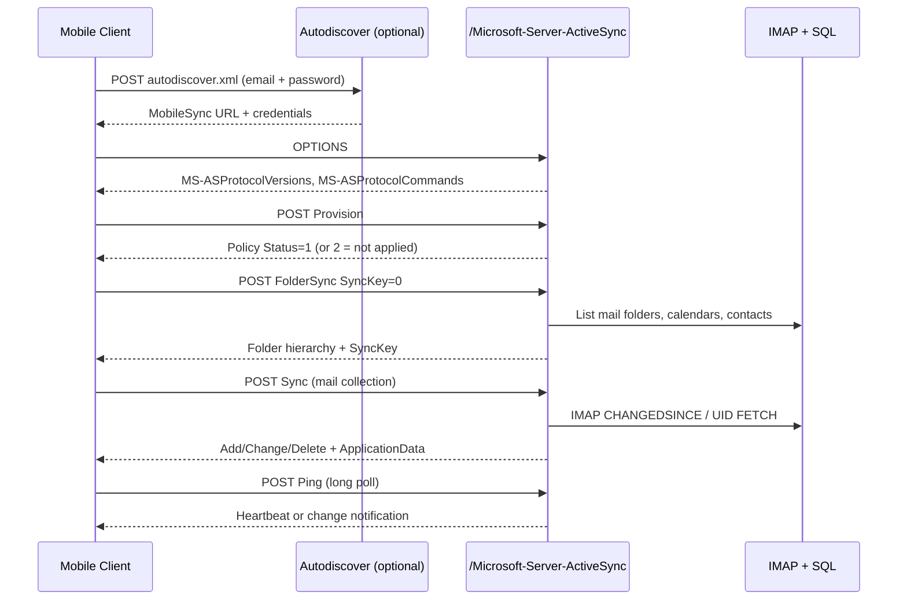
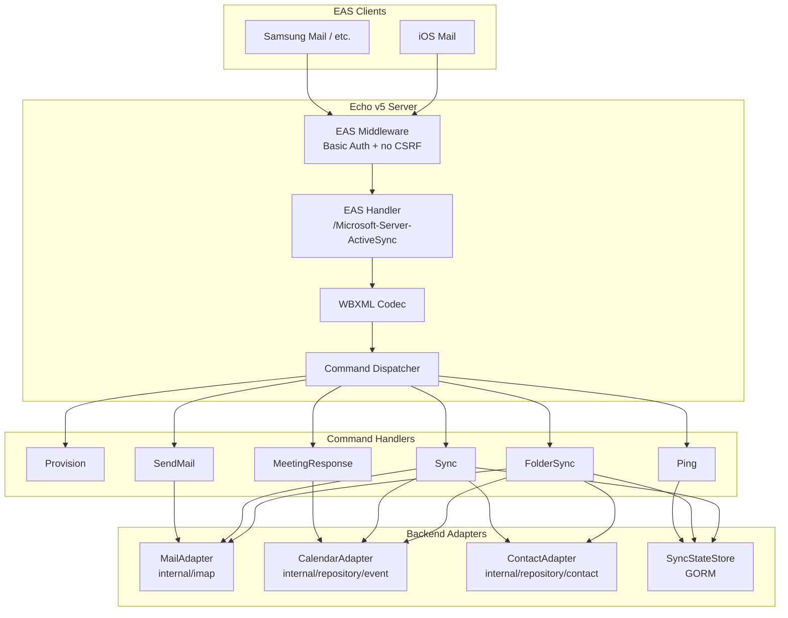

# Microsoft ActiveSync (EAS) Implementation Guide

> **Project:** go-cubemail-vue  
> **Reference:** SOGo ActiveSync bundle (`ActiveSync/`, `UI/MainUI/SOGoMicrosoftActiveSyncActions.m`)  
> **Stack:** Go 1.26 + Echo v5  
> **Status:** Phase 0–5 partial — ItemOperations Fetch, Ping long-poll, Search results implemented; vtodo, EAS 16.1, OOF pending  
> **Related:** [Calendar Implementation Guide](CALENDAR_IMPLEMENTATION.md)

---

## Table of Contents

1. [Executive Summary](#1-executive-summary)
2. [Legal & Licensing Notice](#2-legal--licensing-notice)
3. [What Is Exchange ActiveSync?](#3-what-is-exchange-activesync)
4. [SOGo ActiveSync Analysis (Reference)](#4-sogo-activesync-analysis-reference)
5. [Current State of go-cubemail-vue](#5-current-state-of-go-cubemail-vue)
6. [Go Ecosystem Reality Check](#6-go-ecosystem-reality-check)
7. [Target Architecture](#7-target-architecture)
8. [Technology Stack & Libraries](#8-technology-stack--libraries)
9. [HTTP Endpoint & Protocol Surface](#9-http-endpoint--protocol-surface)
10. [Authentication & Device State](#10-authentication--device-state)
11. [WBXML Pipeline](#11-wbxml-pipeline)
12. [Command Handlers (Step by Step)](#12-command-handlers-step-by-step)
13. [Backend Data Integration](#13-backend-data-integration)
14. [Calendar Sync via ActiveSync](#14-calendar-sync-via-activesync)
15. [Autodiscover](#15-autodiscover)
16. [Deployment & Reverse Proxy](#16-deployment--reverse-proxy)
17. [Feature Roadmap (Phased Delivery)](#17-feature-roadmap-phased-delivery)
18. [Testing Strategy](#18-testing-strategy)
19. [Security & Performance](#19-security--performance)
20. [File & Directory Map](#20-file--directory-map)
21. [Verification Checklist](#21-verification-checklist)

---

## 1. Executive Summary

**Exchange ActiveSync (EAS)** is the HTTP + WBXML protocol used by native mobile mail apps (iOS Mail, Samsung Mail, older Android clients) to sync email, calendar, contacts, and tasks with a server. SOGo ships a native ActiveSync module; go-cubemail-vue does **not** have one yet.

This document describes how to build an EAS **server** in Go for go-cubemail-vue, reusing:

| Existing module | EAS role |
|-----------------|----------|
| `internal/imap/*` | Mail folder sync, message fetch, flags, move |
| `internal/smtp/*` | `SendMail`, meeting replies |
| `internal/repository/contact.go` | Contact folder sync |
| Calendar module (planned) | Event/task sync (`vevent/`, `vtodo/`) |
| GORM / SQL | Device sync state, folder sync keys |

### Important constraint

There is **no production-ready Go EAS server library** today. Existing Go packages (`remdev/go-activesync`, `hstern/go-activesync`) are **clients**. You must implement the server side yourself, using their WBXML codecs and Microsoft's open specifications as references, and SOGo/Z-Push as behavioral references.

### Recommended strategy

1. **Phase 0:** WBXML round-trip + OPTIONS handler + Provision
2. **Phase 1:** FolderSync + Ping (device can "connect")
3. **Phase 2:** Mail Sync (IMAP-backed) — highest user value
4. **Phase 3:** Calendar + Contacts Sync (requires calendar backend from [CALENDAR_IMPLEMENTATION.md](CALENDAR_IMPLEMENTATION.md))
5. **Phase 4:** SendMail, MeetingResponse, Search, Settings

---

## 2. Legal & Licensing Notice

SOGo's ActiveSync README states:

> *"In order to use this software in production environments, you need to get a proper usage license from Microsoft."*

Exchange ActiveSync is a **Microsoft protocol**. Before deploying an EAS server in production:

1. Review Microsoft's intellectual property terms: [Microsoft IP licensing](https://www.microsoft.com/en-us/legal/intellectualproperty/)
2. Contact Microsoft at `iplicreq@microsoft.com` if required for your deployment scale
3. Rely on Microsoft's **Open Specifications** (MS-ASCMD, MS-ASWBXML, MS-ASHTTP, MS-ASPROV) for implementation — these are published for interoperability

This guide is a **technical implementation plan**, not legal advice.

---

## 3. What Is Exchange ActiveSync?

### 3.1 Protocol stack

```
Mobile device (iOS Mail, etc.)
    │
    │  HTTPS POST + query string (Cmd, User, DeviceId, DeviceType)
    │  Body: WBXML (binary XML)
    │  Auth: HTTP Basic (typical) or Bearer/NTLM (Exchange/365)
    ▼
/Microsoft-Server-ActiveSync
    │
    ▼
EAS Server (your Go handler)
    ├── Decode WBXML → XML DOM / structs
    ├── Dispatch by Cmd → handler
    ├── Read/write sync state (per user + device + folder)
    └── Backend adapters: IMAP, SQL calendar, SQL contacts
    │
    ▼
Encode XML → WBXML response
```

### 3.2 Microsoft Open Specifications (required reading)

| Spec | Topic |
|------|-------|
| [MS-ASHTTP](https://learn.microsoft.com/en-us/openspecs/exchange_server_protocols/ms-ashttp) | HTTP transport, headers, query encoding |
| [MS-ASWBXML](https://learn.microsoft.com/en-us/openspecs/exchange_server_protocols/ms-aswbxml) | WBXML code pages and token tables |
| [MS-ASCMD](https://learn.microsoft.com/en-us/openspecs/exchange_server_protocols/ms-ascmd) | All EAS commands |
| [MS-ASPROV](https://learn.microsoft.com/en-us/openspecs/exchange_server_protocols/ms-asprov) | Provisioning, policy keys |
| [MS-ASEMAIL](https://learn.microsoft.com/en-us/openspecs/exchange_server_protocols/ms-asemail) | Email ApplicationData fields |
| [MS-ASCAL](https://learn.microsoft.com/en-us/openspecs/exchange_server_protocols/ms-ascal) | Calendar ApplicationData fields |
| [MS-ASCNTC](https://learn.microsoft.com/en-us/openspecs/exchange_server_protocols/ms-ascntc) | Contact ApplicationData fields |
| [MS-ASTASK](https://learn.microsoft.com/en-us/openspecs/exchange_server_protocols/ms-astask) | Task ApplicationData fields |

### 3.3 Typical device setup flow



---

## 4. SOGo ActiveSync Analysis (Reference)

SOGo implements EAS as a separate Objective-C bundle. Use it as a **behavioral reference**, not code to port line-by-line.

### 4.1 Directory structure

| Path | Role |
|------|------|
| `ActiveSync/SOGoActiveSyncDispatcher.m` | Command routing, FolderSync, SendMail, Ping, Settings, Provision |
| `ActiveSync/SOGoActiveSyncDispatcher+Sync.m` | Sync engine (GetChanges + client Commands) |
| `ActiveSync/NSData+ActiveSync.m` | WBXML ↔ XML via **libwbxml2** |
| `ActiveSync/NSString+ActiveSync.m` | Query string parsing, collection ID decoding |
| `ActiveSync/iCalEvent+ActiveSync.m` | Calendar ↔ EAS XML |
| `ActiveSync/NGVCard+ActiveSync.m` | Contacts ↔ EAS XML |
| `ActiveSync/SOGoMailObject+ActiveSync.m` | Mail ↔ EAS XML |
| `UI/MainUI/SOGoMicrosoftActiveSyncActions.m` | HTTP POST entry point |
| `Tools/SOGoToolManageEAS.m` | Admin CLI: list/reset device sync state |

### 4.2 HTTP entry point

Route registered in `UI/MainUI/product.plist`:

```
POST /SOGo/Microsoft-Server-ActiveSync
```

Apache typically exposes:

```
/Microsoft-Server-ActiveSync → proxy → /SOGo/Microsoft-Server-ActiveSync
```

With long timeout (Ping can block up to several minutes):

```apache
# Apache/SOGo.conf (reference)
#ProxyPass /Microsoft-Server-ActiveSync \
# http://127.0.0.1:20000/SOGo/Microsoft-Server-ActiveSync \
# retry=60 connectiontimeout=5 timeout=360
```

Entry handler (`SOGoMicrosoftActiveSyncActions.m`):

1. Instantiate `SOGoActiveSyncDispatcher`
2. Call `dispatchRequest:inResponse:context:`
3. Return WBXML response

### 4.3 Advertised protocol versions (SOGo)

Response headers:

| Header | SOGo value |
|--------|------------|
| `MS-Server-ActiveSync` | `14.1` |
| `MS-ASProtocolVersions` | `2.5,12.0,12.1,14.0,14.1` |
| `MS-ASProtocolCommands` | Sync, SendMail, FolderSync, Ping, GetItemEstimate, … |
| `Content-Type` | `application/vnd.ms-sync.wbxml` |

> **Note:** Exchange Online requires EAS **16.1+** from March 2026 for native mobile apps. Plan to advertise `16.0,16.1` in a later phase.

### 4.4 Collection ID patterns (SOGo)

| Prefix | Backend | EAS folder type |
|--------|---------|-----------------|
| `mail/{imapFolderGuid}` | IMAP folder | Type 2 (Inbox), 4 (Drafts), etc. |
| `vevent/{calendarName}` | `SOGoAppointmentFolder` | Type 8 (default cal), 13 (user cal) |
| `vtodo/{calendarName}` | Same folder, VTODO | Type 7 / 15 |
| `vcard/{contactFolderName}` | `SOGoContactGCSFolder` | Type 9 / 14 |

Resolved in `SOGoActiveSyncDispatcher.m` → `collectionFromId:type:`.

### 4.5 Sync state storage (SOGo)

Per-device state persisted in GCS cache objects:

| Object | Stores |
|--------|--------|
| `ActiveSyncGlobalCacheObject` | Device-level `FolderSyncKey`, Ping state, concurrent Sync lock |
| `ActiveSyncFolderCacheObject` | Per-collection `SyncKey`, `SyncCache`, `DateCache`, `UidCache` |

go-cubemail-vue equivalent: **SQL tables** (see Section 10).

### 4.6 Commands implemented in SOGo

| Command | SOGo | Priority for go-cubemail-vue |
|---------|------|------------------------------|
| **Provision** | Yes (policy Status=2, not enforced) | **Phase 0** |
| **FolderSync** | Yes | **Phase 1** |
| **Sync** | Yes (mail, calendar, contacts, tasks) | **Phase 2–3** |
| **Ping** | Yes | **Phase 1** |
| **GetItemEstimate** | Yes | Phase 2 |
| **SendMail** | Yes | **Phase 4** ✅ (SMTP + optional Sent append) |
| **MeetingResponse** | Yes | **Phase 4** ✅ (PartStat update; no iMIP reply yet) |
| **Search** | Yes (GAL + mailbox) | **Phase 4** ⚠️ (IMAP count only, no `<Result>` list) |
| **Settings** | Yes (OOF, UserInformation) | **Phase 4** ⚠️ (UserInformation + DeviceInformation; no OOF) |
| **ItemOperations** | Yes | **Phase 5** ⚠️ (mail Fetch + body; no attachments/Move) |
| GetHierarchy | Advertised, **not implemented** | Skip |
| CreateCollection | Advertised, **not implemented** | Optional |

---

## 5. Current State of go-cubemail-vue

| Component | Status |
|-----------|--------|
| EAS endpoint | **Implemented** (`/Microsoft-Server-ActiveSync`, `/autodiscover`) |
| WBXML codec | **Implemented** (`github.com/remdev/go-activesync/wbxml`) |
| Device sync state | **Implemented** (`internal/activesync/state/`) |
| Mail Sync | **Implemented** (IMAP-backed Add/Change/Delete, sync keys) |
| Calendar Sync | **Implemented** (`vevent/*` ↔ SQL events, bidirectional) |
| Contacts Sync | **Implemented** (`vcard/*` ↔ SQL contacts, bidirectional) |
| Tasks Sync (`vtodo/*`) | **Stub** (valid sync keys, no items) |
| GetItemEstimate | **Implemented** (mail, calendar, contacts counts) |
| SendMail | **Implemented** (`SendMailHandler` → `smtp.SendRaw`, optional Sent append) |
| MeetingResponse | **Implemented** (attendee PartStat → SQL event) |
| Search | **Partial** (Result list + Total; no GAL) |
| Settings | **Partial** (UserInformation, DeviceInformation; no OOF) |
| ItemOperations | **Partial** (mail Fetch + body; no attachments) |
| Ping | **Partial** (long-poll on mail folders) |
| IMAP client | **Ready** (`internal/imap/*`) |
| SMTP client | **Ready** (`internal/smtp/*`) — wired to SendMail |
| Contacts SQL | **Ready** (`internal/repository/contact.go`) |
| Calendar SQL | **Ready** (`internal/repository/calendar.go`, `event.go`) |
| Web session auth | Cookie-based (not used by EAS clients) |
| IMAP credential auth | **Implemented** (`internal/server/middleware/eas_auth.go`) |

EAS clients **do not use** the web app's session cookie. They authenticate with **HTTP Basic Auth** on every request, validating credentials against IMAP (same as login).

---

## 6. Go Ecosystem Reality Check

| Project | Role | Server? |
|---------|------|---------|
| [remdev/go-activesync](https://github.com/remdev/go-activesync) | WBXML codec + EAS 14.1 **client** | No — explicitly client-only |
| [hstern/go-activesync](https://github.com/hstern/go-activesync) | Full EAS **client** (all commands, v16.1) | No — use `wbxml` package + integration tests |
| [phires/go-activesync](https://github.com/phires/go-activesync) | Legacy client helpers | No |
| [Z-Push](https://github.com/Z-Hub/Z-Push) | PHP EAS **server** | Reference implementation |
| [grommunio-sync](https://github.com/grommunio/grommunio-sync) | PHP EAS **server** | Reference (v16.1) |
| SOGo `ActiveSync/` | Objective-C EAS **server** | Reference (v14.1) |

### Practical approach for go-cubemail-vue

1. **Reuse WBXML layer** from `remdev/go-activesync/wbxml` (or port code pages from `hstern/go-activesync/wbxml`)
2. **Build server dispatch** in `internal/activesync/` following SOGo's command map
3. **Test against real clients** using `hstern/go-activesync` client in integration tests
4. **Do not** embed Z-Push (PHP) unless you accept a polyglot deployment

---

## 7. Target Architecture

### 7.1 High-level diagram



### 7.2 Package layout

```
internal/activesync/
├── handler.go           # Echo route: OPTIONS + POST
├── dispatcher.go        # Cmd routing → processX()
├── middleware.go        # Basic auth, EAS headers, skip CSRF
├── wbxml/
│   ├── codec.go         # Encode/decode (wrap remdev or custom)
│   └── pages.go         # EAS code page tables (MS-ASWBXML)
├── commands/
│   ├── provision.go
│   ├── foldersync.go
│   ├── sync.go
│   ├── ping.go
│   ├── sendmail.go
│   ├── getitemestimate.go
│   ├── meetingresponse.go
│   └── settings.go
├── adapters/
│   ├── mail.go          # IMAP folder list, sync, fetch
│   ├── calendar.go      # Event ↔ MS-ASCAL ApplicationData
│   ├── contacts.go      # Contact ↔ MS-ASCNTC ApplicationData
│   └── tasks.go         # Optional VTODO
├── state/
│   ├── store.go         # SyncKey read/write interface
│   └── model.go         # GORM: EasDevice, EasFolderState
└── types/
    ├── request.go       # Parsed query params
    └── response.go      # Response builders
```

### 7.3 Echo route registration

Add to `internal/server/routes.go` **outside** the CSRF-protected SPA group:

```go
// ActiveSync — separate from /api/v1; uses Basic Auth, not session cookies
eas := e.Group("/Microsoft-Server-ActiveSync")
eas.Use(appMiddleware.EASAuth(cfg))          // Basic auth → IMAP validate
eas.Use(appMiddleware.EASHeaders())           // Protocol version headers on OPTIONS

eas.OPTIONS("", h.ActiveSync.Options)
eas.POST("", h.ActiveSync.Handle)
```

Also register Autodiscover routes (Section 15).

### 7.4 Middleware differences from web API

| Middleware | Web API `/api/v1` | ActiveSync |
|------------|-------------------|------------|
| Session cookie | Yes | **No** |
| CSRF | Yes | **No** — EAS clients don't send CSRF tokens |
| Auth | `RequireAuth` cookie | **HTTP Basic Auth** per request |
| Content-Type | `application/json` | `application/vnd.ms-sync.wbxml` |
| Timeout | Default (~30s) | **Extended** for Ping (up to 360s) |

---

## 8. Technology Stack & Libraries

### 8.1 Required Go dependencies

```bash
# WBXML codec (recommended starting point)
go get github.com/remdev/go-activesync/wbxml

# Or use hstern's wbxml for broader version coverage
go get github.com/hstern/go-activesync/wbxml

# Already in go-cubemail-vue
# github.com/emersion/go-imap/v2
# github.com/wneessen/go-mail
# gorm.io/gorm
```

### 8.2 Optional dependencies

```bash
go get github.com/hstern/go-activesync/eas   # integration test client only (dev)
```

### 8.3 System dependencies (alternative to pure Go WBXML)

SOGo uses **libwbxml2** (C library). In Go you can:

| Option | Pros | Cons |
|--------|------|------|
| Pure Go (`remdev/go-activesync/wbxml`) | No CGO, easy cross-compile | Must verify all code pages |
| CGO + libwbxml2 | Battle-tested (same as SOGo) | CGO complicates builds |
| Manual XML + custom encoder | Full control | High maintenance |

**Recommendation:** Start with `remdev/go-activesync/wbxml` or port `hstern/go-activesync/wbxml`. SOGo's libwbxml settings for ActiveSync:

```c
// ActiveSync/NSData+ActiveSync.m — outbound encoding
wbxml_conv_xml2wbxml_disable_public_id(conv);
wbxml_conv_xml2wbxml_disable_string_table(conv);
// WBXML_LANG_ACTIVESYNC
```

Apply the same flags in your Go encoder.

### 8.4 Dev/integration test dependency

Use `hstern/go-activesync` client to validate your server:

```go
//go:build integration

func TestEASFolderSync(t *testing.T) {
    c, err := eas.NewClient(eas.Config{
        ServerURL: "https://localhost:8443/Microsoft-Server-ActiveSync",
        Username:  "user@example.com",
        Password:  "secret",
        DeviceID:  "testdevice000000000000000001",
        State:     eas.NewMemoryState(),
    })
    require.NoError(t, err)
    ctx := context.Background()
    _, err = c.NegotiateVersion(ctx)
    require.NoError(t, err)
    require.NoError(t, c.Provision(ctx))
    folders, err := c.FolderSync(ctx)
    require.NoError(t, err)
    require.NotEmpty(t, folders.Added)
}
```

---

## 9. HTTP Endpoint & Protocol Surface

### 9.1 URL and query parameters

**Endpoint:**

```
POST /Microsoft-Server-ActiveSync?Cmd={command}&User={username}&DeviceId={id}&DeviceType={type}
```

| Query param | Required | Description |
|-------------|----------|-------------|
| `Cmd` | Yes | Command name: `Sync`, `FolderSync`, `Provision`, `Ping`, … |
| `User` | Yes | Username (informational; auth from Basic header) |
| `DeviceId` | Yes | Unique device identifier (missing → HTTP 500 in SOGo) |
| `DeviceType` | Yes | e.g. `iPhone`, `Android` |
| `CollectionId` | Sync only | e.g. `mail/{guid}`, `vevent/personal` |
| `Options` | Optional | e.g. `AcceptMultiPart` |

MS-ASHTTP also allows **base64-encoded binary query strings** — implement after plain query works.

### 9.2 Required request headers (client → server)

| Header | Example | Notes |
|--------|---------|-------|
| `Authorization` | `Basic base64(user:pass)` | Primary auth |
| `MS-ASProtocolVersion` | `14.1` | Negotiated version |
| `Content-Type` | `application/vnd.ms-sync.wbxml` | Request body |
| `User-Agent` | Device-specific | Logging only |

### 9.3 Required response headers (server → client)

Set on **every** EAS response:

```go
func setEASHeaders(c *echo.Context, protocolVersion string) {
    c.Response().Header().Set("MS-Server-ActiveSync", protocolVersion)
    c.Response().Header().Set("MS-ASProtocolVersions", "2.5,12.0,12.1,14.0,14.1,16.0,16.1")
    c.Response().Header().Set("MS-ASProtocolCommands",
        "Sync,SendMail,FolderSync,GetItemEstimate,MeetingResponse,Search,Settings,Ping,ItemOperations,Provision,ResolveRecipients,MoveItems")
    c.Response().Header().Set("Content-Type", "application/vnd.ms-sync.wbxml")
}
```

### 9.4 OPTIONS handler

Clients probe capabilities before first POST:

```go
func (h *ActiveSyncHandler) Options(c *echo.Context) error {
    setEASHeaders(c, "14.1")
    c.Response().Header().Set("Allow", "OPTIONS, POST")
    return c.NoContent(http.StatusOK)
}
```

### 9.5 POST dispatcher skeleton

```go
func (h *ActiveSyncHandler) Handle(c *echo.Context) error {
    cmd := c.QueryParam("Cmd")
    deviceID := c.QueryParam("DeviceId")
    if deviceID == "" {
        return c.NoContent(http.StatusInternalServerError)
    }

    body, err := io.ReadAll(c.Request().Body)
    if err != nil {
        return err
    }

    // Decode WBXML (skip for Ping/Sync with empty body)
    xmlDoc, err := h.codec.Decode(body)
    if err != nil {
        return c.NoContent(http.StatusBadRequest)
    }

    user := c.Get("eas_user").(string) // from Basic auth middleware
    ctx := &RequestContext{
        User: user, DeviceID: deviceID,
        DeviceType: c.QueryParam("DeviceType"),
        ProtocolVersion: c.Request().Header.Get("MS-ASProtocolVersion"),
        Query: c.QueryParams(),
    }

    xmlResponse, err := h.dispatcher.Dispatch(ctx, cmd, xmlDoc)
    if err != nil {
        return mapEASError(c, err)
    }

    wbxmlOut, err := h.codec.Encode(xmlResponse)
    if err != nil {
        return err
    }

    setEASHeaders(c, ctx.ProtocolVersion)
    _, err = c.Response().Write(wbxmlOut)
    return err
}
```

Command routing (mirror SOGo `performSelector: process{Cmd}:`):

```go
func (d *Dispatcher) Dispatch(ctx *RequestContext, cmd string, doc []byte) ([]byte, error) {
    switch cmd {
    case "Provision":
        return d.provision.Handle(ctx, doc)
    case "FolderSync":
        return d.foldersync.Handle(ctx, doc)
    case "Sync":
        return d.sync.Handle(ctx, doc)
    case "Ping":
        return d.ping.Handle(ctx, doc)
    case "GetItemEstimate":
        return d.getitemestimate.Handle(ctx, doc)
    case "SendMail":
        return d.sendmail.Handle(ctx, doc)
    case "MeetingResponse":
        return d.meetingresponse.Handle(ctx, doc)
    default:
        return nil, ErrUnsupportedCommand
    }
}
```

---

## 10. Authentication & Device State

### 10.1 Basic Auth middleware

EAS clients send credentials on every request. Validate against IMAP (same as `AuthHandler.DoLogin`):

```go
// internal/server/middleware/eas_auth.go
func EASAuth(cfg *config.Config) echo.MiddlewareFunc {
    return func(next echo.HandlerFunc) echo.HandlerFunc {
        return func(c *echo.Context) error {
            user, pass, ok := c.Request().BasicAuth()
            if !ok {
                c.Response().Header().Set("WWW-Authenticate", `Basic realm="go-cubemail"`)
                return c.NoContent(http.StatusUnauthorized)
            }
            // Reuse IMAP login validation from auth handler
            if err := imap.ValidateCredentials(cfg, user, pass); err != nil {
                return c.NoContent(http.StatusUnauthorized)
            }
            c.Set("eas_user", user)
            c.Set("eas_password", pass) // encrypted short-lived or use per-request IMAP conn
            return next(c)
        }
    }
}
```

> **Security:** Do not log passwords. Prefer opening a short-lived IMAP connection per Sync request rather than storing plaintext passwords in memory.

### 10.2 Device sync state (SQL schema)

Replace SOGo's GCS cache with GORM models:

```go
// internal/activesync/state/model.go

type EasDevice struct {
    ID             uint      `gorm:"primaryKey"`
    UserID         uint      `gorm:"uniqueIndex:idx_user_device;not null"`
    DeviceID       string    `gorm:"uniqueIndex:idx_user_device;size:64;not null"`
    DeviceType     string    `gorm:"size:64"`
    FolderSyncKey  string    `gorm:"size:255;default:'0'"`
    PolicyKey      uint      `gorm:"default:0"`
    LastPingAt     *time.Time
    CreatedAt      time.Time
    UpdatedAt      time.Time
}

type EasFolderState struct {
    ID             uint      `gorm:"primaryKey"`
    EasDeviceID    uint      `gorm:"index;not null"`
    CollectionID   string    `gorm:"size:255;not null"` // mail/{guid}, vevent/personal
    SyncKey        string    `gorm:"size:255;default:'0'"`
    FilterType     int       `gorm:"default:0"`
    SyncCacheJSON  string    `gorm:"type:text"` // map[itemId]lastModified
    CreatedAt      time.Time
    UpdatedAt      time.Time
}
```

Add to `cmd/migrate.go`:

```go
&activesync.EasDevice{},
&activesync.EasFolderState{},
```

### 10.3 SyncKey semantics

| SyncKey value | Meaning |
|---------------|---------|
| `0` | Initial sync — client expects full folder list or full collection state |
| `{n}` | Opaque server token — increment on each successful sync |
| Invalid key | Return Status `3` (InvalidSyncKey) — client resets and retries with `0` |

Generate sync keys as monotonic integers or UUIDs; store per `(device, collection)`.

SOGo pattern:

1. Client sends `SyncKey=0` → server returns new key + all items (or empty Changes)
2. Client sends last known key → server returns delta or Status 3 if stale

---

## 11. WBXML Pipeline

### 11.1 Encode/decode flow

```
Inbound:  POST body (WBXML bytes)
            → wbxml.Decode() → XML bytes or struct
            → command handler

Outbound: handler builds XML string or struct
            → wbxml.Encode() → WBXML bytes
            → response body
```

### 11.2 ActiveSync-specific encoding rules

From SOGo `NSData+ActiveSync.m`:

1. Use ActiveSync WBXML dialect (not generic WAP WBXML)
2. Disable public ID in document type
3. Disable string table
4. Switch code pages per MS-ASWBXML token tables (25 code pages for EAS 14.1)

### 11.3 Using remdev/go-activesync tags

Define structs with `wbxml` tags matching code pages:

```go
type FolderSyncRequest struct {
    XMLName xml.Name `wbxml:"FolderHierarchy.FolderSync"`
    SyncKey string   `wbxml:"FolderHierarchy.SyncKey"`
}

type SyncCollection struct {
    SyncKey      string `wbxml:"AirSync.SyncKey"`
    CollectionID string `wbxml:"AirSync.CollectionId"`
    WindowSize   int    `wbxml:"AirSync.WindowSize,omitempty"`
    Options      *SyncOptions `wbxml:"AirSync.Options,omitempty"`
    Commands     *SyncCommands `wbxml:"AirSync.Commands,omitempty"`
}
```

Reference: `remdev/go-activesync/eas/` for typed models per MS-ASEMAIL, MS-ASCAL, etc.

### 11.4 Debug mode

Mirror SOGo's `SOGoEASDebugEnabled`:

```toml
# config.toml
[activesync]
debug = false
debug_dir = "/tmp/eas-debug"
```

When enabled, write decoded XML request/response to disk for troubleshooting.

---

## 12. Command Handlers (Step by Step)

### Phase 0: Provision + OPTIONS (1–3 days)

**Goal:** Device completes "Exchange account" setup through provisioning.

#### Provision response (minimal — SOGo style)

SOGo returns policy Status `2` (not applied):

```xml
<Provision xmlns="Provision:">
  <Status>1</Status>
  <Policies>
    <Policy>
      <PolicyType>MS-EAS-Provisioning-WBXML</PolicyType>
      <Status>2</Status>
    </Policy>
  </Policies>
</Provision>
```

Implement:

```go
func (h *ProvisionHandler) Handle(ctx *RequestContext, doc []byte) ([]byte, error) {
    // Parse PolicyKey from request; store on EasDevice
    return buildProvisionResponse(statusOK, policyNotApplied), nil
}
```

Handle MS-ASPROV status codes:

| Status | Action |
|--------|--------|
| 142 | Re-provision required |
| 143 | Invalid policy key — reset |

**Verification:** `hstern/go-activesync` client `Provision()` succeeds.

---

### Phase 1: FolderSync + Ping (1 week)

#### FolderSync

Build folder hierarchy for authenticated user:

| Folder | CollectionId | Type (EAS) |
|--------|--------------|------------|
| Inbox | `mail/{imapFolderId}` | 2 |
| Drafts | `mail/{guid}` | 3 |
| Sent | `mail/{guid}` | 4 |
| Trash | `mail/{guid}` | 5 |
| Personal (calendar) | `vevent/personal` | 8 |
| Personal (tasks) | `vtodo/personal` | 7 |
| Contacts | `vcard/personal` | 9 |

Steps:

1. Parse incoming `SyncKey`
2. If `SyncKey == "0"`: enumerate all folders → `<Add>` elements
3. Else: diff against stored state → `<Add>`, `<Update>`, `<Delete>`
4. Return new `SyncKey` in response

```xml
<FolderSync xmlns="FolderHierarchy:">
  <Status>1</Status>
  <SyncKey>1</SyncKey>
  <Changes>
    <Count>3</Count>
    <Add>
      <ServerId>mail/abc123</ServerId>
      <ParentId>0</ParentId>
      <DisplayName>Inbox</DisplayName>
      <Type>2</Type>
    </Add>
    <!-- ... -->
  </Changes>
</FolderSync>
```

**MailAdapter.ListFolders():**

```go
func (a *MailAdapter) ListFolders(ctx context.Context, imapUser, imapPass string) ([]Folder, error) {
    client, err := imap.Connect(a.cfg, imapUser, imapPass)
    // LIST command → map to mail/{stableId}
    // Stable ID: use IMAP UIDVALIDITY + folder path hash (SOGo uses GUID table)
}
```

#### Ping (long poll)

Ping keeps a connection open until a change occurs or heartbeat expires.

1. Parse `<Ping>` with `<HeartbeatInterval>` and `<Folders>` list
2. Loop until change detected or timeout (respect `SOGoMaximumPingInterval`-style config, default 10–30s)
3. Return `<Ping><Status>1</Status><Folders>...</Folders></Ping>` with changed folder IDs

Configure Echo/server timeout ≥ 360s for this route (match SOGo Apache config).

**Verification:** iOS Mail account saves without "Unable to verify account" error.

---

### Phase 2: Mail Sync (2 weeks)

The Sync command has two directions:

| Direction | XML element | Server action |
|-----------|-------------|---------------|
| Server → client | `<GetChanges>` / implicit in Sync | IMAP FETCH changes since last sync |
| Client → server | `<Commands><Add/Change/Delete>` | IMAP APPEND, STORE flags, MOVE, EXPUNGE |

#### Server → client (GetChanges)

For `CollectionId = mail/{folderId}`:

1. Load `EasFolderState.SyncKey`
2. If invalid → Status 3
3. Query IMAP:
   - Use `CONDSTORE` / `MODSEQ` if available (SOGo tracks MODSEQ)
   - Fallback: UID range + `\Seen`, `\Deleted` flags since last sync
4. For each changed message, build `<Add>` or `<Change>` with:

```xml
<ApplicationData xmlns="Email:">
  <Subject>Hello</Subject>
  <From>alice@example.com</From>
  <To>bob@example.com</To>
  <DateReceived>2026-05-30T10:00:00.000Z</DateReceived>
  <Read>0</Read>
  <Body>...</Body>
  <!-- MS-ASEMAIL fields -->
</ApplicationData>
```

Map from IMAP envelope + body fetch (`internal/imap/message.go`).

#### Client → server (Commands)

| Command | IMAP action |
|---------|-------------|
| `<Change><Read>1</Read>` | STORE +FLAGS (\Seen) |
| `<Delete>` | STORE +FLAGS (\Deleted) + EXPUNGE |
| `<Change>` move | MOVE to folder (RFC 6851) |
| `<Add>` | Rare for mail — usually SendMail instead |

Reference: `ActiveSync/SOGoMailObject+ActiveSync.m`, `SOGoActiveSyncDispatcher+Sync.m`.

#### GetItemEstimate

Return approximate item count per collection:

```xml
<GetItemEstimate xmlns="GetItemEstimate:">
  <Status>1</Status>
  <Collection>
    <CollectionId>mail/abc</CollectionId>
    <Estimate>42</Estimate>
    <Status>1</Status>
  </Collection>
</GetItemEstimate>
```

For mail: IMAP SEARCH ALL count. For calendar: SQL `COUNT(*)` on events table.

**Verification:** Send test email → appears on phone within one Sync cycle.

---

### Phase 3: Calendar & Contacts Sync (2 weeks)

Requires calendar backend from [CALENDAR_IMPLEMENTATION.md](CALENDAR_IMPLEMENTATION.md).

#### Calendar collection sync

Collection: `vevent/personal` (or `vevent/{calendarName}`)

Server → client fields (MS-ASCAL):

| EAS field | go-cubemail source |
|-----------|-------------------|
| `Subject` | `event.Summary` |
| `StartTime` | `event.StartAt` (EAS date format) |
| `EndTime` | `event.EndAt` |
| `Location` | `event.Location` |
| `Body` | `event.Description` |
| `UID` | `event.UID` |
| `AllDayEvent` | `event.IsAllDay` |
| `Recurrence` | Parse from `event.RRule` |
| `Attendees` | `event_attendees` table |
| `Reminder` | `event_alarms` table |
| `MeetingStatus` | Derive from organizer/attendees |
| `Timezone` | Binary blob (Phase 4 — see SOGo `iCalTimeZone+ActiveSync.m`) |

Reference mapper: `ActiveSync/iCalEvent+ActiveSync.m` (~960 lines).

```go
func (a *CalendarAdapter) ToApplicationData(event *model.Event, attendees []model.EventAttendee) (string, error) {
    var b strings.Builder
    b.WriteString(`<Subject>` + xmlEscape(event.Summary) + `</Subject>`)
    b.WriteString(`<StartTime>` + easTime(event.StartAt) + `</StartTime>`)
    // ... all MS-ASCAL fields
    return b.String(), nil
}
```

Change detection: compare `event.UpdatedAt` against `EasFolderState.SyncCacheJSON[itemId]`.

Client → server (create event from phone):

1. Parse `<ApplicationData>` from Sync Add/Change command
2. Map to `model.Event` + attendees
3. Save via `EventRepository`
4. Regenerate `ICalContent`

#### Contacts collection sync

Collection: `vcard/personal`

Map `model.Contact` ↔ MS-ASCNTC fields (`FileAs`, `Email1Address`, `FirstName`, `LastName`, `Phone`).

Reference: `ActiveSync/NGVCard+ActiveSync.m`.

**Verification:** Create event on iPhone → visible in web calendar; create contact on web → syncs to phone.

---

### Phase 4: SendMail, MeetingResponse, Search, Settings — **implemented (MVP)**

| Command | File | Status |
|---------|------|--------|
| SendMail | `commands/sendmail.go` | ✅ WBXML/raw MIME → `smtp.SendRaw`; optional IMAP Sent append |
| MeetingResponse | `commands/meetingresponse.go` | ✅ UserResponse → attendee PartStat; WBXML `<Result>`; iMIP reply not sent |
| Search | `commands/search.go` | ⚠️ Returns `<Total>` via IMAP SEARCH; no individual `<Result>` |
| Settings | `commands/settings.go` | ⚠️ UserInformation + DeviceInformation; OOF not implemented |

Shared helpers: `commands/imapconn.go` (`imapConnect`, `appendToSent`), `internal/smtp/raw.go` (`SendRaw`).

#### SendMail

1. Decode WBXML body → extract base64 MIME (or raw `message/rfc822` for protocol ≥12.1) — **done**
2. Send via `internal/smtp` — **done**
3. Optionally APPEND to Sent folder via IMAP — **done**

Reference: `SOGoActiveSyncDispatcher.m` → `processSendMail:` (~line 3470).

#### MeetingResponse

When user accepts/declines meeting on phone:

1. Parse `<MeetingResponse>` with `UserResponse` (1=Accept, 2=Decline, 3=Tentative) — **done**
2. Find event by `CalendarId` + UID — **done**
3. Update attendee `PartStat` — **done**
4. Send iMIP REPLY via SMTP — **not implemented**

Reference: `processMeetingResponse:` + `iCalEvent changeParticipationStatus:`.

#### Search

Mailbox search via IMAP SEARCH (Subject/From/Body free-text) — **partial** (count only). GAL search not implemented.

#### Settings

UserInformation (EmailAddresses, SmtpAddress) and DeviceInformation (Model, UserAgent, FriendlyName) — **done**. OOF / DevicePassword not implemented.

---

### Phase 5: ItemOperations, Ping long-poll, Search results — **partial**

| Command | File | Status |
|---------|------|--------|
| ItemOperations | `commands/itemoperations.go` | ⚠️ Mail Fetch with AirSyncBase.Body via IMAP RFC822 |
| Ping | `commands/ping.go` | ⚠️ Long-poll loop comparing mail sync cache vs IMAP |
| Search | `commands/search.go` | ⚠️ `<Result>` list with LongId + Properties + Range |
| Email fetch helper | `commands/emailfetch.go` | Shared body builder for ItemOperations and Search |

**Still pending:** attachment Fetch (FileReference), Move, EmptyFolderContents, calendar/contacts Ping, vtodo sync, EAS 16.1, Settings OOF, MeetingResponse iMIP.

---

## 13. Backend Data Integration

### 13.1 Integration matrix

| EAS collection | go-cubemail backend | Change tracking |
|----------------|---------------------|-----------------|
| `mail/*` | `internal/imap/*` | IMAP UID + MODSEQ / flags |
| `vevent/*` | `internal/repository/event.go` | `updated_at` column |
| `vtodo/*` | Same events table (`component=vtodo`) | `updated_at` |
| `vcard/*` | `internal/repository/contact.go` | `updated_at` |
| Device/folder state | `internal/activesync/state/*` | SyncKey counters |

### 13.2 IMAP folder stable IDs

SOGo maintains a mapping of IMAP folder → GUID (`imapFolderGUIDS` in dispatcher). Implement:

```go
type ImapFolderMapping struct {
    ID         uint   `gorm:"primaryKey"`
    UserID     uint   `gorm:"index"`
    FolderPath string `gorm:"size:255"` // e.g. INBOX
    FolderGUID string `gorm:"size:64;uniqueIndex"` // used in mail/{guid}
    UIDValidity uint32
}
```

Generate GUID on first FolderSync; invalidate if UIDVALIDITY changes.

### 13.3 Handler registration

Update `internal/handler/handler.go`:

```go
type Handlers struct {
    // ... existing ...
    ActiveSync *ActiveSyncHandler
}

func New(cfg *config.Config, db *gorm.DB) *Handlers {
    easState := activesync.NewStateStore(db)
    return &Handlers{
        // ...
        ActiveSync: activesync.NewHandler(cfg, db, easState),
    }
}
```

---

## 14. Calendar Sync via ActiveSync

This section connects EAS to the calendar module. **Implement calendar REST API first** (see [CALENDAR_IMPLEMENTATION.md](CALENDAR_IMPLEMENTATION.md)), then add EAS adapter.

### 14.1 SOGo calendar sync flow

```
Phone → POST Sync CollectionId=vevent/personal
  → SOGoActiveSyncDispatcher+Sync.m processSyncCollection
    → SOGoAppointmentFolder syncTokenFieldsWithProperties (c_component=vevent)
      → compare c_lastmodified vs device SyncCache
        → Add/Change/Delete with iCalEvent activeSyncRepresentationInContext
```

### 14.2 go-cubemail equivalent

```
Phone → POST Sync CollectionId=vevent/personal
  → activesync/commands/sync.go
    → CalendarAdapter.GetChanges(userID, "personal", since)
      → EventRepo.ListModifiedSince(userID, calendarName, since)
        → CalendarAdapter.ToApplicationData(event)
```

### 14.3 Recurrence in EAS

MS-ASCAL uses structured recurrence XML (not raw RRULE string):

```xml
<Recurrence>
  <Type>0</Type>           <!-- 0=Daily, 1=Weekly, 2=Monthly, 3=MonthlyByDay, 5=Yearly -->
  <Interval>1</Interval>
  <WeekOfMonth>0</WeekOfMonth>
  <DayOfWeek>62</DayOfWeek> <!-- bitmask: Mon=2, Tue=4, Wed=8, ... -->
  <Occurrences>10</Occurrences>
</Recurrence>
```

Convert between `event.RRule` (iCalendar) and EAS recurrence in `internal/activesync/adapters/recurrence.go`.

Reference: `ActiveSync/iCalRecurrenceRule+ActiveSync.m`.

### 14.4 Exception instances

Recurring event exceptions use:

- Same `UID` as master
- `Exception` field set to `1`
- `InstanceId` or `StartTime` identifying the occurrence

Store as separate `Event` row with `RecurrenceID` set (same as REST calendar model).

### 14.5 MeetingResponse → calendar

Link to mail invitation flow:

1. User accepts meeting on phone → `MeetingResponse` command
2. Server updates `event_attendees.partstat`
3. If event came from email invitation (`CalendarInfo.UID`), match by UID
4. Optionally trigger same logic as `ReadingPane.vue` RSVP

---

## 15. Autodiscover

Mobile clients prefer Autodiscover over manual server URL entry.

### 15.1 Endpoints to implement

| Endpoint | Protocol | Purpose |
|----------|----------|---------|
| `POST /autodiscover/autodiscover.xml` | POX XML (not WBXML) | Primary Autodiscover |
| `GET /.well-known/autodiscover/autodiscover.xml` | Redirect | iOS/macOS |
| `OPTIONS /Microsoft-Server-ActiveSync` | HTTP | Fallback probe (SOGo-style) |

### 15.2 Autodiscover POX response

```xml
<?xml version="1.0" encoding="utf-8"?>
<Autodiscover xmlns="http://schemas.microsoft.com/exchange/autodiscover/responseschema/2006">
  <Response xmlns="http://schemas.microsoft.com/exchange/autodiscover/mobilesync/responseschema/2006">
    <Culture>en:us</Culture>
    <User>
      <DisplayName>User Name</DisplayName>
      <EMailAddress>user@example.com</EMailAddress>
    </User>
    <Action>
      <Settings>
        <Setting>
          <SettingType>MobileSync</SettingType>
          <RootUrl>https://mail.example.com/Microsoft-Server-ActiveSync</RootUrl>
        </Setting>
      </Settings>
    </Action>
  </Response>
</Autodiscover>
```

Echo handler:

```go
// POST /autodiscover/autodiscover.xml
func (h *AutodiscoverHandler) MobileSync(c *echo.Context) error {
    // Parse email from request body
    // Validate credentials (optional at autodiscover stage)
    // Return XML with RootUrl from cfg.Server.BaseURL + "/Microsoft-Server-ActiveSync"
    c.Response().Header().Set("Content-Type", "text/xml; charset=utf-8")
    return c.Blob(http.StatusOK, "text/xml; charset=utf-8", responseXML)
}
```

Reference specs: MS-OXDISCO, MS-ASAB.

### 15.3 DNS SRV record (optional)

```
_autodiscover._tcp.example.com.  IN  SRV  0 0 443 mail.example.com.
```

---

## 16. Deployment & Reverse Proxy

### 16.1 TLS requirement

EAS clients **require HTTPS**. Configure TLS in go-cubemail or terminate at reverse proxy:

```toml
# config.toml
[server]
tls_cert = "/etc/ssl/certs/mail.example.com.crt"
tls_key  = "/etc/ssl/private/mail.example.com.key"
base_url = "https://mail.example.com"
```

### 16.2 Nginx configuration

```nginx
# ActiveSync — long timeout for Ping
location /Microsoft-Server-ActiveSync {
    proxy_pass         http://127.0.0.1:8080;
    proxy_read_timeout 360s;
    proxy_send_timeout 360s;
    proxy_buffering    off;
    proxy_http_version 1.1;
    proxy_set_header   Host $host;
    proxy_set_header   X-Real-IP $remote_addr;
    proxy_set_header   Authorization $http_authorization;
}

# Autodiscover
location /autodiscover/autodiscover.xml {
    proxy_pass http://127.0.0.1:8080;
}

location /.well-known/autodiscover/autodiscover.xml {
    proxy_pass http://127.0.0.1:8080/autodiscover/autodiscover.xml;
}
```

### 16.3 Disable CSRF for EAS routes

Ensure `appMiddleware.CSRF()` skips `/Microsoft-Server-ActiveSync` and `/autodiscover/*`:

```go
func CSRF() echo.MiddlewareFunc {
    return func(next echo.HandlerFunc) echo.HandlerFunc {
        return func(c *echo.Context) error {
            path := c.Request().URL.Path
            if strings.HasPrefix(path, "/Microsoft-Server-ActiveSync") ||
               strings.HasPrefix(path, "/autodiscover") {
                return next(c)
            }
            // ... existing CSRF logic
        }
    }
}
```

### 16.4 Config section

Add to `internal/config/config.go`:

```go
type ActiveSyncConfig struct {
    Enabled            bool   `mapstructure:"enabled"`
    Debug              bool   `mapstructure:"debug"`
    MaxSyncWindowSize  int    `mapstructure:"max_sync_window_size"`  // default 100
    MaxPingIntervalSec int    `mapstructure:"max_ping_interval_sec"`   // default 30
    MaxSyncIntervalSec int    `mapstructure:"max_sync_interval_sec"`   // default 30
    ProtocolVersions   string `mapstructure:"protocol_versions"`     // default "14.1"
}
```

```toml
# config.toml
[activesync]
enabled = true
debug = false
max_sync_window_size = 100
max_ping_interval_sec = 30
max_sync_interval_sec = 30
protocol_versions = "14.1"
```

---

## 17. Feature Roadmap (Phased Delivery)

| Phase | Duration | Deliverables | Device capability |
|-------|----------|--------------|-------------------|
| **0** | 3 days | OPTIONS, Provision, WBXML codec, config | Account validates |
| **1** | 1 week | FolderSync, Ping, device state SQL | Folder list appears |
| **2** | 2 weeks | Mail Sync, GetItemEstimate | Email sync works |
| **3** | 2 weeks | Calendar + Contacts Sync | Full PIM sync |
| **4** | 2 weeks | SendMail, MeetingResponse, Search, Settings | Send/reply/accept meetings |
| **5** | Optional | EAS 16.1, ItemOperations, Autodiscover polish, policy | Modern iOS + Exchange Online compat |

### Dependency graph

```
Phase 0 (WBXML + Provision)
    └── Phase 1 (FolderSync + Ping)
            └── Phase 2 (Mail Sync)
                    ├── Phase 3a (Contacts Sync) — can parallel
                    └── Phase 3b (Calendar Sync) — requires CALENDAR_IMPLEMENTATION Phase 1
                            └── Phase 4 (SendMail + MeetingResponse)
```

---

## 18. Testing Strategy

### 18.1 Unit tests

```
internal/activesync/wbxml/codec_test.go     — round-trip known frames
internal/activesync/commands/provision_test.go
internal/activesync/adapters/calendar_test.go — Event ↔ ApplicationData
internal/activesync/state/store_test.go     — SyncKey increment, invalid key
```

Use fixture WBXML blobs captured from SOGo debug mode (`SOGoEASDebugEnabled`).

### 18.2 Integration tests (Go client against your server)

```bash
# Start go-cubemail with TLS on :8443
EAS_INTEGRATION_URL=https://localhost:8443/Microsoft-Server-ActiveSync \
EAS_INTEGRATION_USER=test@example.com \
EAS_INTEGRATION_PASS=secret \
go test -tags integration ./internal/activesync/...
```

Test sequence:

1. `NegotiateVersion` → OPTIONS headers match
2. `Provision` → Status 1
3. `FolderSync` → mail + calendar folders present
4. `Sync` (inbox) → empty or seeded messages
5. `Ping` → returns within heartbeat

### 18.3 Manual device testing

| Client | Test |
|--------|------|
| iOS Mail | Add Exchange account → sync mail + calendar + contacts |
| Android Samsung Mail | Same |
| Outlook mobile | Uses different protocol — **not EAS** |

### 18.4 Admin tooling

Implement CLI similar to SOGo's `sogo-tool manage-eas`:

```bash
go-cubemail eas list-devices --user alice@example.com
go-cubemail eas reset-device --user alice@example.com --device-id ABC123
go-cubemail eas reset-folder --user alice@example.com --collection vevent/personal
```

---

## 19. Security & Performance

### 19.1 Security

| Concern | Mitigation |
|---------|------------|
| Credential exposure | TLS only; never log Basic auth |
| Brute force | Rate limit `/Microsoft-Server-ActiveSync` (separate from web login) |
| User isolation | Scope all sync state and data by authenticated user |
| WBXML bomb | Limit request body size (e.g. 10 MB); bounded decoder allocations |
| Device spoofing | Track DeviceId per user; optional device approval (future) |
| Remote wipe | Not in MVP — SOGo also skips enforcement |

### 19.2 Performance

| Concern | Mitigation |
|---------|------------|
| Ping blocking | Dedicated long-timeout route; limit concurrent Pings per user |
| Sync window | Cap `WindowSize` (SOGo: `SOGoMaximumSyncWindowSize`) |
| IMAP round-trips | Pool IMAP connections per sync request; batch FETCH |
| Large mailboxes | FilterType sync (e.g. 5 days) — honor client `<FilterType>` |
| DB sync cache | JSON column indexed by device; prune old devices |

### 19.3 Concurrent sync guard

SOGo locks concurrent Sync per device. Implement:

```go
func (s *StateStore) AcquireSyncLock(deviceID uint) (release func(), err error) {
    // SELECT FOR UPDATE or in-memory mutex per device
}
```

Return EAS Sync Status `8` (ObjectNotFound) or wait — match SOGo behavior on conflict.

---

## 20. File & Directory Map

### New files

```
internal/activesync/
├── handler.go
├── dispatcher.go
├── autodiscover.go
├── middleware.go
├── wbxml/codec.go
├── commands/{provision,foldersync,sync,ping,sendmail,getitemestimate,meetingresponse,settings}.go
├── adapters/{mail,calendar,contacts,recurrence}.go
└── state/{model,store}.go

internal/handler/activesync.go          # thin wrapper if preferred
internal/server/middleware/eas_auth.go
cmd/eas.go                              # admin CLI (list/reset devices)
```

### Modified files

```
internal/server/routes.go               # EAS + Autodiscover routes
internal/server/middleware/csrf.go      # skip EAS paths
internal/handler/handler.go             # wire ActiveSyncHandler
internal/config/config.go               # ActiveSyncConfig
cmd/migrate.go                          # EasDevice, EasFolderState, ImapFolderMapping
go.mod                                  # remdev/go-activesync/wbxml or similar
config.toml.example                     # [activesync] section
```

---

## 21. Verification Checklist

### Phase 0

- [ ] `OPTIONS /Microsoft-Server-ActiveSync` returns `MS-ASProtocolVersions`
- [ ] WBXML encode/decode round-trip passes unit tests
- [ ] `Provision` returns Status 1 with hstern client

### Phase 1

- [ ] `FolderSync` returns Inbox + calendar + contacts folders
- [ ] Device row created in `eas_devices` table
- [ ] `Ping` completes without timeout at reverse proxy
- [ ] iOS account setup passes "Verifying"

### Phase 2

- [ ] New IMAP message appears on phone after Sync
- [ ] Read/unread flag syncs both directions
- [ ] Delete on phone removes message via IMAP

### Phase 3

- [ ] Event created on phone appears in web calendar
- [ ] Event created in web app syncs to phone
- [ ] Contact sync bidirectional

### Phase 4

- [ ] Send mail from phone arrives at recipient (requires SMTP integration test)
- [ ] Sent copy appears in Sent folder when `SaveInSentItems=1`
- [ ] Accept meeting on phone updates attendee status in web calendar
- [ ] Search returns non-zero Total for known messages
- [ ] Settings returns UserInformation with authenticated email

---

## Appendix A: SOGo Source Quick Reference

| Topic | File |
|-------|------|
| HTTP entry | `UI/MainUI/SOGoMicrosoftActiveSyncActions.m` |
| Dispatcher | `ActiveSync/SOGoActiveSyncDispatcher.m` |
| Sync engine | `ActiveSync/SOGoActiveSyncDispatcher+Sync.m` |
| WBXML | `ActiveSync/NSData+ActiveSync.m` |
| Calendar mapping | `ActiveSync/iCalEvent+ActiveSync.m` |
| Contacts mapping | `ActiveSync/NGVCard+ActiveSync.m` |
| Mail mapping | `ActiveSync/SOGoMailObject+ActiveSync.m` |
| Admin tool | `Tools/SOGoToolManageEAS.m` |
| Apache proxy | `Apache/SOGo.conf` |

## Appendix B: EAS Status Codes (common)

| Code | Meaning | Action |
|------|---------|--------|
| 1 | Success | Continue |
| 3 | Invalid SyncKey | Client resets to SyncKey=0 |
| 4 | Protocol error | Log and return error |
| 6 | Server error | Retry |
| 7 | Conflict | Client refreshes |
| 8 | Object not found | Remove from client |
| 12 | Folder hierarchy changed | Client runs FolderSync |
| 13 | Empty Sync request | Return error (SOGo unsupported) |

## Appendix C: Related go-cubemail-vue Documents

| Document | Relationship |
|----------|--------------|
| [ACTIVESYNC_STATUS_ROADMAP_AND_PHP_REFERENCE.md](ACTIVESYNC_STATUS_ROADMAP_AND_PHP_REFERENCE.md) | Full delivery status, remaining work, Go test client, Horde PHP analysis |
| [ACTIVESYNC_GO_REFERENCE.md](ACTIVESYNC_GO_REFERENCE.md) | Go function reference (godoc index) |
| [ACTIVESYNC_CURL_TESTING.md](ACTIVESYNC_CURL_TESTING.md) | cURL and integration test commands |
| [CALENDAR_IMPLEMENTATION.md](CALENDAR_IMPLEMENTATION.md) | Calendar REST API must exist before EAS calendar sync (Phase 3) |
| [DEVELOPMENT.md](DEVELOPMENT.md) | Build/run workflow for testing |
| [SDD.md](SDD.md) | System design overview |

---

*Document version: 1.1 — Phase 4 SendMail/MeetingResponse/Search/Settings MVP.*
