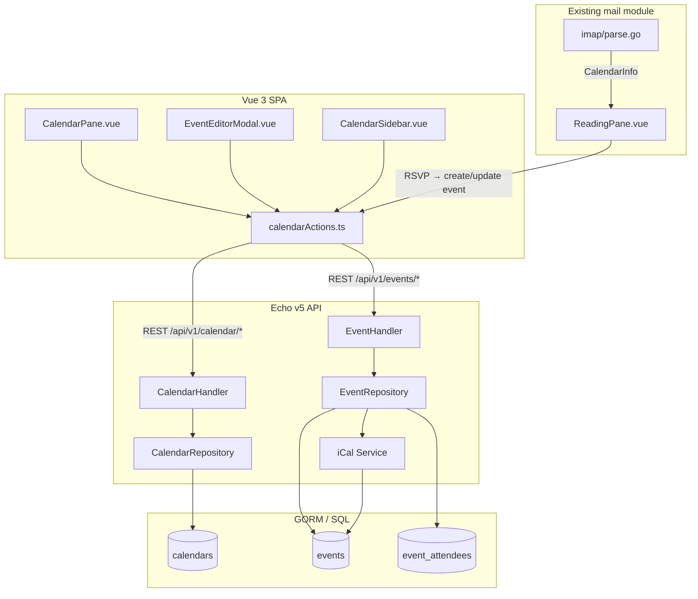

# Calendar Module Implementation Guide

> **Project:** go-cubemail-vue  
> **Reference:** SOGo Calendar (`SoObjects/Appointments`, `UI/Scheduler`)  
> **Stack:** Go 1.26 + Echo v5 (backend) · Vue 3.5 + Pinia + Vite (frontend)  
> **Status:** Planning document — calendar UI exists as a mock; no backend calendar module yet  
> **Related:** [ActiveSync Implementation Guide](ACTIVESYNC_IMPLEMENTATION.md) — mobile calendar/mail sync via EAS

---

## Table of Contents

1. [Executive Summary](#1-executive-summary)
2. [SOGo Calendar Analysis (Reference)](#2-sogo-calendar-analysis-reference)
3. [Current State of go-cubemail-vue](#3-current-state-of-go-cubemail-vue)
4. [Target Architecture](#4-target-architecture)
5. [Technology Stack & Libraries](#5-technology-stack--libraries)
6. [Data Model & Storage Strategy](#6-data-model--storage-strategy)
7. [REST API Design](#7-rest-api-design)
8. [Backend Implementation (Step by Step)](#8-backend-implementation-step-by-step)
9. [Frontend Implementation (Step by Step)](#9-frontend-implementation-step-by-step)
10. [iCalendar (RFC 5545) Handling](#10-icalendar-rfc-5545-handling)
11. [Mail Integration (Meeting Invitations)](#11-mail-integration-meeting-invitations)
12. [Feature Roadmap (Phased Delivery)](#12-feature-roadmap-phased-delivery)
13. [Testing Strategy](#13-testing-strategy)
14. [Security & Performance](#14-security--performance)
15. [File & Directory Map](#15-file--directory-map)
16. [Verification Checklist](#16-verification-checklist)

---

## 1. Executive Summary

This document describes how to implement a full calendar module for **go-cubemail-vue**, using SOGo's calendar subsystem as a functional reference while adapting patterns already established in this project (Echo handlers, GORM repositories, Pinia action modules, axios REST calls).

### Goals

| Goal | Description |
|------|-------------|
| **Calendar management** | Create, rename, color, activate/deactivate personal calendars |
| **Event CRUD** | Create, read, update, delete events with title, time, location, description |
| **Multiple views** | Month, week, day grid (replacing the current mock `CalendarPane.vue`) |
| **Recurrence** | RRULE support (daily, weekly, monthly, yearly) |
| **Attendees & RSVP** | Optional participants; integrate with existing mail iCal parsing |
| **Import/Export** | `.ics` file import and export |
| **Free/busy** | Optional availability grid for scheduling (Phase 3+) |

### What SOGo teaches us

SOGo stores calendar data as **iCalendar files** in a content store, with a **denormalized quick table** for fast range queries. The web UI talks to Objective-C controllers via JSON endpoints under `/SOGo/so/{user}/Calendar/...`. go-cubemail-vue should mirror the **API semantics** (not the Objective-C internals) using Go + SQL.

### What already exists in go-cubemail-vue

| Component | Status |
|-----------|--------|
| `CalendarPane.vue` | UI shell with hardcoded May 2026 + mock events |
| `stores/mail/mockData.ts` | Demo `CAL_EVENTS` data |
| `internal/imap/parse.go` | Parses `text/calendar` MIME parts in **email** (not a calendar store) |
| `ReadingPane.vue` | RSVP buttons for meeting invitations (stub actions) |
| Backend calendar routes | **None** |

---

## 2. SOGo Calendar Analysis (Reference)

Understanding SOGo's design helps you decide what to replicate and what to simplify.

### 2.1 Backend Object Hierarchy

```
SOGoUserFolder
  └── Calendar → SOGoAppointmentFolders
        ├── SOGoAppointmentFolder        (personal / shared calendars)
        ├── SOGoWebAppointmentFolder     (remote .ics subscriptions)
        └── SOGoAppointmentInboxFolder   (scheduling inbox)
              └── SOGoAppointmentObject  (VEVENT)
                    └── SOGoAppointmentOccurence (single recurrence instance)
```

**Key files:**

| Concern | Path |
|---------|------|
| Domain folder model | `SoObjects/Appointments/SOGoAppointmentFolder.h` |
| Event object (CalDAV PUT/DELETE) | `SoObjects/Appointments/SOGoAppointmentObject.m` |
| Recurrence logic | `SoObjects/Appointments/SOGoComponentOccurence.m` |
| Free/busy | `SoObjects/Appointments/SOGoFreeBusyObject.m` |
| DB schema (quick + blob tables) | `SOPE/GDLContentStore/appointment.ocs` |
| HTTP route registry | `UI/Scheduler/product.plist` |
| List calendars API | `UI/Scheduler/UIxCalendarSelector.m` |
| Events grid API | `UI/Scheduler/UIxCalListingActions.m` |
| Event save/view API | `UI/Scheduler/UIxAppointmentEditor.m` |

### 2.2 SOGo Storage Model

SOGo uses a **dual-table** pattern per calendar folder:

**Blob table** — full iCalendar text:

| Column | Purpose |
|--------|---------|
| `c_name` | Resource filename (e.g. `{uid}.ics`) — PK |
| `c_content` | Full VCALENDAR/VEVENT iCalendar TEXT |
| `c_creationdate`, `c_lastmodified`, `c_version`, `c_deleted` | Metadata |

**Quick table** — indexed fields for queries:

| Column | Purpose |
|--------|---------|
| `c_uid` | VEVENT UID |
| `c_startdate`, `c_enddate`, `c_cycleenddate` | Unix epoch timestamps |
| `c_title`, `c_location`, `c_description` | Text fields |
| `c_iscycle`, `c_cycleinfo` | Recurrence flag + RRULE info |
| `c_isallday`, `c_isopaque`, `c_status`, `c_priority` | Event flags |
| `c_participants`, `c_partmails`, `c_partstates`, `c_orgmail` | Attendees |
| `c_nextalarm` | Next alarm epoch |
| `c_component` | `vevent` or `vtodo` |

> **Design lesson:** Keep the canonical iCalendar blob for interoperability (export, CalDAV later), but maintain denormalized columns for fast `WHERE start <= ? AND end >= ?` queries.

### 2.3 SOGo Web API Endpoints (Reference)

Base path: `/SOGo/so/{username}/Calendar`

#### Calendar folder operations

| Method | Route | Purpose |
|--------|-------|---------|
| GET | `/calendarslist` | List all calendars with colors, active state, URLs |
| POST | `/createFolder` | Create calendar `{ name }` |
| POST | `/{calId}/save` | Save calendar properties (name, color, free-busy flag) |
| POST | `/saveFoldersActivation` | Toggle calendar visibility `{ calId: 0\|1 }` |
| POST | `/addWebCalendar` | Subscribe to remote `.ics` URL |
| GET | `/{calId}/export` | Export calendar as `text/calendar` |
| POST | `/{calId}/import` | Import `.ics` multipart upload |
| GET/POST | `/userRights` | ACL / sharing |

#### Event operations

| Method | Route | Purpose |
|--------|-------|---------|
| GET | `/{calId}/newguid` | Generate `{ pid, id }` for new event |
| GET | `/{calId}/{eventId}/view` | Full event JSON (+ optional `recurrenceId`) |
| POST | `/{calId}/{eventId}/save` | Save event JSON payload |
| POST | `/{calId}/{eventId}/adjust` | Drag-resize: `{ days, start, duration, destination }` |
| POST | `/{calId}/{eventId}/rsvpAppointment` | Update participation status |
| DELETE | `/{calId}/{eventId}` | Delete event |
| DELETE | `/{calId}/{eventId}/{recurrenceId}` | Delete single occurrence |

#### Listing / grid data

| Method | Route | Query params | Purpose |
|--------|-------|--------------|---------|
| GET | `/eventslist` | `day`, `filter`, `search` | List view (grouped by month/day) |
| GET | `/eventsblocks` | `sd`, `ed`, `view` | Grid blocks for day/week/month views |
| GET | `/alarmslist` | `browserTime` | Upcoming reminders |
| GET | `/taskslist` | — | VTODO tasks |

#### Save payload shape (from `UIxAppointmentEditor.m`)

```json
{
  "summary": "Team standup",
  "location": "Room A",
  "comment": "Daily sync",
  "startDate": "2026-05-30",
  "startTime": "09:00",
  "endDate": "2026-05-30",
  "endTime": "09:30",
  "isAllDay": false,
  "isTransparent": false,
  "status": "CONFIRMED",
  "priority": 5,
  "classification": "PUBLIC",
  "categories": ["Work"],
  "organizer": { "name": "Alice", "email": "alice@example.com" },
  "attendees": [
    { "name": "Bob", "email": "bob@example.com", "partstat": "NEEDS-ACTION", "role": "REQ-PARTICIPANT" }
  ],
  "alarm": {
    "action": "DISPLAY",
    "quantity": 15,
    "unit": "MINUTES",
    "reference": "START"
  },
  "repeat": {
    "frequency": "WEEKLY",
    "interval": 1,
    "count": 10,
    "days": ["MO", "WE", "FR"]
  },
  "destinationCalendar": "personal",
  "sendAppointmentNotifications": true
}
```

### 2.4 SOGo Frontend (AngularJS Reference)

| File | Role |
|------|------|
| `UI/WebServerResources/js/Scheduler/Scheduler.app.js` | UI-Router states: `/calendar/{day\|week\|month}/{date}` |
| `Calendar.service.js` | Calendar CRUD, subscription |
| `Component.service.js` | Event CRUD, `$eventsBlocksForView()` |
| `Attendees.service.js` | Attendee free/busy grid |
| `CalendarController.js` | Day/week/month grid controller |
| `CalendarListController.js` | List view + drag-drop save |
| `ComponentController.js` | Event editor dialog |
| `sgCalendar*.directive.js` | Rendering directives (day blocks, month events, ghost drag) |

**Data flow for grid views:**

```
CalendarController
  → Component.$eventsBlocksForView(view, date)
    → GET /Calendar/eventsblocks?sd=&ed=&view=
      → returns { days, eventsFields, events, blocks, allDayBlocks }
  → sgCalendarDay / sgCalendarDayBlock directives render
```

### 2.5 SOGo Features Matrix

| Feature | SOGo implementation | Recommended for go-cubemail-vue |
|---------|---------------------|--------------------------------|
| Personal calendars | `SOGoAppointmentFolder` | **Phase 1** — SQL-backed |
| Web calendar subscribe | `SOGoWebAppointmentFolder` | Phase 3 |
| Recurring events | RRULE in blob + `c_iscycle` quick field | **Phase 2** |
| Attendees + iMIP mail | `SOGoAptMailInvitation.m` etc. | Phase 2–3 |
| Drag-resize events | `adjust` action | Phase 2 |
| Free/busy grid | `SOGoFreeBusyObject` + `freebusy.ifb` | Phase 3 |
| Tasks (VTODO) | `SOGoTaskObject` | Phase 4 (optional) |
| CalDAV | `SOGoAppointmentObject PUTAction` | Phase 4 (optional) |
| ACL / sharing | `UIxCalUserRightsEditor` | Phase 3 |
| Alarms/reminders | `SOGoEMailAlarmsManager` | Phase 3 |

---

## 3. Current State of go-cubemail-vue

### 3.1 Project Layout

```
go-cubemail-vue/
├── cmd/                    # Cobra CLI (serve, migrate, init)
├── internal/
│   ├── handler/            # HTTP handlers (no service layer)
│   ├── repository/         # GORM data access
│   ├── model/              # GORM entities
│   ├── imap/               # IMAP + MIME/iCal parsing
│   ├── server/routes.go    # Echo route registration
│   └── session/            # Encrypted IMAP session
├── frontend/               # Vue 3 SPA (Vite build → web/dist)
└── web/dist/               # Embedded in Go binary
```

### 3.2 Existing Patterns to Follow

The **contacts module** is the closest template for a new calendar module:

| Layer | Contacts example | Calendar equivalent |
|-------|------------------|---------------------|
| Handler | `internal/handler/contacts.go` | `internal/handler/calendar.go` |
| Repository | `internal/repository/contact.go` | `internal/repository/calendar.go`, `event.go` |
| Model | `internal/model/contact.go` | `internal/model/calendar.go`, `event.go` |
| Routes | `routes.go` L59–65 | New `/calendar/*` group |
| Frontend actions | `frontend/src/stores/mail/contactActions.ts` | `calendarActions.ts` |
| Frontend component | `ContactsPane.vue` | Extend `CalendarPane.vue` |
| Types | `frontend/src/types.ts` | Extend `CalEvent`, add `Calendar`, `Event` types |
| Migration | `cmd/migrate.go` | Add new models to `AutoMigrate` |

### 3.3 Auth & Session Pattern

All protected routes use `RequireAuth` middleware:

```go
// internal/server/middleware/auth.go
s := c.Get("imap_session").(*session.IMAPSession)
// s.Username → resolve to model.User.ID via FirstOrCreate
```

Frontend uses axios with `API_BASE = '/api/v1'` and CSRF double-submit cookie on mutating requests.

### 3.4 Calendar UI Mock (current)

`CalendarPane.vue` renders a 7×6 month grid using:

- `mail.calDow` — day-of-week headers
- `mail.calCells` — built by `buildCalCells()` in `utils/helpers.ts`
- Hardcoded "May 2026" title; toolbar buttons are non-functional
- Events from `mockData.ts` (`CAL_EVENTS`)

RSVP/delegate in `stores/mail/index.ts` are toast-only stubs.

### 3.5 Existing iCal Parsing (mail only)

`internal/imap/parse.go` extracts `CalendarInfo` from email MIME parts:

```go
type CalendarInfo struct {
    Method    string   // REQUEST, CANCEL, REPLY
    Summary   string
    Organizer string
    StartTime string
    EndTime   string
    Location  string
    UID       string
    Attendees []string
}
```

This is exposed in message read JSON as `is_calendar_request` + `calendar_info`. It does **not** persist events to a calendar store.

---

## 4. Target Architecture

### 4.1 High-Level Diagram



### 4.2 Layer Responsibilities

| Layer | Responsibility |
|-------|----------------|
| **Handler** | HTTP binding, auth context, JSON request/response, validation |
| **Repository** | SQL queries, transactions, user scoping |
| **iCal service** | Serialize/deserialize RFC 5545; generate UIDs; expand RRULE |
| **Frontend actions** | axios calls, Pinia state updates, error toasts |
| **Frontend components** | View rendering, user interaction, modal forms |

> **Note:** go-cubemail-vue intentionally has no separate `service/` package. Keep handlers thin; put business logic in repository + a new `internal/calendar/` package for iCal/recurrence.

### 4.3 View State Machine (Frontend)

Replace hardcoded view with Pinia state:

```typescript
type CalendarView = 'month' | 'week' | 'day'
interface CalendarState {
  view: CalendarView
  currentDate: Date          // anchor date for navigation
  calendars: Calendar[]      // sidebar list
  activeCalendarIds: number[] // visible calendars
  events: Event[]            // loaded for current range
  selectedEvent: Event | null
  editorOpen: boolean
}
```

Navigation:

- **Prev/Next** — shift `currentDate` by 1 day/week/month
- **Today** — reset `currentDate` to `new Date()`
- **View switch** — change `view`, re-fetch events for new range

---

## 5. Technology Stack & Libraries

### 5.1 Backend (Go) — Existing

| Library | Version | Use |
|---------|---------|-----|
| `github.com/labstack/echo/v5` | v5.1.1 | HTTP server, routing, middleware |
| `gorm.io/gorm` | v1.31.1 | ORM, migrations |
| `gorm.io/driver/sqlite` | v1.6.0 | Default DB |
| `github.com/spf13/viper` | v1.21.0 | Configuration |

### 5.2 Backend (Go) — New Dependencies

Add these to `go.mod`:

```bash
go get github.com/emersion/go-ical          # RFC 5545 parser/serializer
go get github.com/teambition/rrule-go       # RRULE expansion (recurrence)
go get github.com/google/uuid               # Event UID generation
go get github.com/go-playground/validator/v10  # Request validation (optional)
```

| Library | Purpose | Why this choice |
|---------|---------|-----------------|
| **`github.com/emersion/go-ical`** | Parse/build `.ics` components | Same author as `go-imap` / `go-message` already in project; consistent ecosystem |
| **`github.com/teambition/rrule-go`** | Expand RRULE into occurrences | Battle-tested; used for range queries on recurring events |
| **`github.com/google/uuid`** | Generate VEVENT UIDs | Standard, collision-resistant |
| **`github.com/arran4/golang-ical`** | Alternative iCal lib | Consider if `go-ical` API is insufficient; evaluate both in Phase 0 spike |

> **Spike recommendation:** Before Phase 1, write a 50-line spike that parses a sample `.ics` with `go-ical`, serializes it back, and expands a WEEKLY RRULE with `rrule-go`. Pick the library that handles your edge cases (all-day, TZID, EXDATE).

### 5.3 Frontend — Existing

| Library | Version | Use |
|---------|---------|-----|
| `vue` | ^3.5.34 | UI framework |
| `pinia` | ^3.0.4 | State management |
| `axios` | 1.16.1 (vendored) | HTTP client |
| `tailwindcss` | ^4.3.0 | Styling |
| `@lucide/vue` | ^1.16.0 | Icons |

### 5.4 Frontend — New Dependencies (Recommended)

```bash
cd frontend
npm install @fullcalendar/core @fullcalendar/vue3 @fullcalendar/daygrid @fullcalendar/timegrid @fullcalendar/interaction
npm install date-fns
npm install --save-dev @types/node
```

| Library | Purpose | Alternative |
|---------|---------|-------------|
| **`@fullcalendar/vue3`** | Production-grade day/week/month grid | Build custom grid (current mock approach) — more work |
| **`date-fns`** | Date math, formatting, range calculation | Native `Intl` + manual math |
| **`rrule`** (npm) | Client-side recurrence preview in editor | Backend-only expansion initially |

> **Decision point:** FullCalendar gives you drag-drop, resize, and all-day lanes out of the box (similar to SOGo's `sgCalendar*` directives). The current CSS grid in `CalendarPane.vue` is fine for month view only; FullCalendar is recommended for week/day views.

### 5.5 Optional Future Dependencies

| Library | Phase | Purpose |
|---------|-------|---------|
| `github.com/emersion/go-webdav` | 4 | CalDAV server |
| `github.com/wneessen/go-mail` | 2 | Already present — send iMIP invitations |
| `@vueuse/core` | 2 | Reactive date/locale utilities |

---

## 6. Data Model & Storage Strategy

### 6.1 Recommended SQL Schema

Inspired by SOGo's quick table, simplified for GORM:

#### `calendars` table

```go
// internal/model/calendar.go
type Calendar struct {
    ID               uint      `gorm:"primaryKey"`
    UserID           uint      `gorm:"index;not null"`
    Name             string    `gorm:"size:255;not null"`
    Color            string    `gorm:"size:7;default:'#3788d8'"` // hex
    IsDefault        bool      `gorm:"default:false"`
    IsActive         bool      `gorm:"default:true"`
    IncludeInFreeBusy bool     `gorm:"default:true"`
    SortOrder        int       `gorm:"default:0"`
    CreatedAt        time.Time
    UpdatedAt        time.Time
}
```

#### `events` table

```go
// internal/model/event.go
type Event struct {
    ID            uint      `gorm:"primaryKey"`
    CalendarID    uint      `gorm:"index;not null"`
    UserID        uint      `gorm:"index;not null"` // owner, denormalized for queries
    UID           string    `gorm:"size:255;uniqueIndex;not null"` // iCal UID
    Summary       string    `gorm:"size:1000;not null"`
    Description   string    `gorm:"type:text"`
    Location      string    `gorm:"size:255"`
    StartAt       time.Time `gorm:"index;not null"`
    EndAt         time.Time `gorm:"index;not null"`
    IsAllDay      bool      `gorm:"default:false"`
    IsTransparent bool      `gorm:"default:false"` // free/busy: transparent = free
    Status        string    `gorm:"size:20;default:'CONFIRMED'"` // TENTATIVE, CONFIRMED, CANCELLED
    Priority      int       `gorm:"default:0"`
    Classification string   `gorm:"size:20;default:'PUBLIC'"` // PUBLIC, PRIVATE, CONFIDENTIAL
    Categories    string    `gorm:"size:255"` // comma-separated
    OrganizerName  string   `gorm:"size:255"`
    OrganizerEmail string   `gorm:"size:255"`
    RRule         string    `gorm:"type:text"` // RRULE string, empty = non-recurring
    RecurrenceID  *time.Time // non-null = exception instance
    Sequence      int       `gorm:"default:0"`
    ICalContent   string    `gorm:"type:text"` // canonical .ics blob
    CreatedAt     time.Time
    UpdatedAt     time.Time
}
```

#### `event_attendees` table

```go
type EventAttendee struct {
    ID        uint   `gorm:"primaryKey"`
    EventID   uint   `gorm:"index;not null"`
    Name      string `gorm:"size:255"`
    Email     string `gorm:"size:255;not null"`
    PartStat  string `gorm:"size:20;default:'NEEDS-ACTION'"` // ACCEPTED, DECLINED, TENTATIVE
    Role      string `gorm:"size:30;default:'REQ-PARTICIPANT'"`
    RSVP      bool   `gorm:"default:true"`
}
```

#### `event_alarms` table (Phase 2)

```go
type EventAlarm struct {
    ID        uint   `gorm:"primaryKey"`
    EventID   uint   `gorm:"index;not null"`
    Action    string `gorm:"size:20;default:'DISPLAY'"` // DISPLAY, EMAIL
    Trigger   int    `gorm:"not null"` // seconds before START (negative)
}
```

### 6.2 Index Strategy

```sql
-- Fast range queries (most common)
CREATE INDEX idx_events_user_range ON events(user_id, start_at, end_at);
CREATE INDEX idx_events_calendar_range ON events(calendar_id, start_at, end_at);

-- UID lookup for import/sync
CREATE UNIQUE INDEX idx_events_uid ON events(uid);
```

### 6.3 Default Calendar on First Login

When a user first accesses calendar (or on login), ensure a default calendar exists:

```go
func (r *CalendarRepo) EnsureDefault(userID uint) (*model.Calendar, error) {
    var cal model.Calendar
    err := r.db.Where("user_id = ? AND is_default = ?", userID, true).First(&cal).Error
    if err == gorm.ErrRecordNotFound {
        cal = model.Calendar{
            UserID: userID, Name: "Personal", Color: "#3788d8",
            IsDefault: true, IsActive: true,
        }
        err = r.db.Create(&cal).Error
    }
    return &cal, err
}
```

Mirror SOGo's `personal` calendar convention.

### 6.4 Recurring Event Storage Strategy

Two valid approaches:

| Approach | Pros | Cons |
|----------|------|------|
| **A. Master + exceptions** (recommended) | Compact; SOGo-style | Complex update logic |
| **B. Expand all occurrences** | Simple queries | Storage explosion |

**Recommended (Approach A):**

1. Store one master `Event` row with `RRule` populated
2. Store exception rows with same `UID` + non-null `RecurrenceID`
3. At query time, expand RRULE for `[start, end]` range using `rrule-go`, merge with exceptions
4. Cache expanded occurrences in memory per request (not in DB)

---

## 7. REST API Design

Base path: `/api/v1` (consistent with existing routes in `internal/server/routes.go`).

### 7.1 Calendar Endpoints

| Method | Route | Description |
|--------|-------|-------------|
| GET | `/calendar` | List user calendars |
| POST | `/calendar` | Create calendar |
| PUT | `/calendar/:id` | Update name, color, flags |
| DELETE | `/calendar/:id` | Delete calendar (and all events) |
| POST | `/calendar/activation` | Bulk toggle `{ "ids": [1,2], "active": true }` |
| GET | `/calendar/:id/export` | Download `.ics` |
| POST | `/calendar/:id/import` | Upload `.ics` multipart |

#### GET `/calendar` — Response

```json
{
  "calendars": [
    {
      "id": 1,
      "name": "Personal",
      "color": "#3788d8",
      "is_default": true,
      "is_active": true,
      "include_in_free_busy": true,
      "sort_order": 0
    }
  ]
}
```

### 7.2 Event Endpoints

| Method | Route | Description |
|--------|-------|-------------|
| GET | `/events` | List events in date range |
| GET | `/events/:id` | Get single event (+ attendees, alarms) |
| POST | `/events` | Create event |
| PUT | `/events/:id` | Update event |
| DELETE | `/events/:id` | Delete event |
| POST | `/events/:id/move` | Move/resize (SOGo `adjust` equivalent) |
| POST | `/events/:id/rsvp` | Update attendee partstat |

#### GET `/events` — Query params

| Param | Type | Required | Description |
|-------|------|----------|-------------|
| `start` | ISO 8601 date | yes | Range start (inclusive) |
| `end` | ISO 8601 date | yes | Range end (exclusive) |
| `calendar_ids` | comma-separated ints | no | Filter by calendars |
| `expand` | boolean | no | Expand recurring events (default: true) |

#### GET `/events` — Response

```json
{
  "events": [
    {
      "id": 42,
      "calendar_id": 1,
      "uid": "abc-123@go-cubemail",
      "summary": "Team standup",
      "description": "",
      "location": "Room A",
      "start_at": "2026-05-30T09:00:00Z",
      "end_at": "2026-05-30T09:30:00Z",
      "is_all_day": false,
      "status": "CONFIRMED",
      "color": "#3788d8",
      "recurrence_id": null,
      "is_recurring": true,
      "rrule": "FREQ=WEEKLY;BYDAY=MO,WE,FR",
      "attendees": [
        { "name": "Bob", "email": "bob@example.com", "partstat": "ACCEPTED" }
      ]
    }
  ]
}
```

#### POST `/events` — Request

```json
{
  "calendar_id": 1,
  "summary": "New meeting",
  "description": "Discuss roadmap",
  "location": "Online",
  "start_at": "2026-06-01T14:00:00Z",
  "end_at": "2026-06-01T15:00:00Z",
  "is_all_day": false,
  "attendees": [
    { "email": "bob@example.com", "name": "Bob" }
  ],
  "rrule": null,
  "alarm": { "minutes_before": 15 }
}
```

#### POST `/events/:id/move` — Request (drag-resize)

```json
{
  "start_at": "2026-06-01T15:00:00Z",
  "end_at": "2026-06-01T16:00:00Z",
  "calendar_id": 2,
  "recurrence_scope": "this" 
}
```

`recurrence_scope`: `"this"` | `"all"` | `"future"` (for recurring events).

### 7.3 Mapping SOGo → go-cubemail-vue

| SOGo endpoint | go-cubemail-vue equivalent |
|---------------|---------------------------|
| `GET /Calendar/calendarslist` | `GET /api/v1/calendar` |
| `GET /Calendar/eventsblocks` | `GET /api/v1/events?start=&end=&expand=true` |
| `GET /Calendar/:calId/:eventId/view` | `GET /api/v1/events/:id` |
| `POST /Calendar/:calId/:eventId/save` | `PUT /api/v1/events/:id` |
| `POST /Calendar/:calId/:eventId/saveAsAppointment` | `POST /api/v1/events` |
| `POST /Calendar/:calId/:eventId/adjust` | `POST /api/v1/events/:id/move` |
| `DELETE /Calendar/:calId/:eventId` | `DELETE /api/v1/events/:id` |
| `GET /Calendar/:calId/export` | `GET /api/v1/calendar/:id/export` |
| `POST /Calendar/:calId/import` | `POST /api/v1/calendar/:id/import` |

---

## 8. Backend Implementation (Step by Step)

### Phase 0: Spike & Dependencies (1–2 days)

1. Add Go dependencies (`go-ical`, `rrule-go`, `uuid`)
2. Create `internal/calendar/ical_test.go` with parse/serialize round-trip test
3. Create `internal/calendar/recurrence_test.go` with WEEKLY RRULE expansion test
4. Verify all tests pass: `go test ./internal/calendar/...`

### Phase 1: Core CRUD (1 week)

#### Step 1.1 — Models

Create files:

```
internal/model/calendar.go
internal/model/event.go
internal/model/event_attendee.go
```

#### Step 1.2 — Migration

Update `cmd/migrate.go`:

```go
err = db.AutoMigrate(
    // ... existing models ...
    &model.Calendar{},
    &model.Event{},
    &model.EventAttendee{},
)
```

Run: `./go-cubemail migrate` (or `make migrate` if defined).

#### Step 1.3 — Repository

Create:

```
internal/repository/calendar.go   // List, Create, Update, Delete, EnsureDefault
internal/repository/event.go      // ListByRange, GetByID, Create, Update, Delete
```

Follow `internal/repository/contact.go` patterns:

- Always scope by `user_id`
- Use `Where("user_id = ?", userID)` on every query
- Return typed structs, not `map[string]any`

#### Step 1.4 — iCal Service

Create `internal/calendar/ical.go`:

```go
package calendar

// BuildICalContent generates a VCALENDAR string from an Event model.
func BuildICalContent(event *model.Event, attendees []model.EventAttendee) (string, error)

// ParseICalImport parses an .ics file into []ImportEvent for bulk insert.
func ParseICalImport(data []byte) ([]ImportEvent, error)

// NewUID generates a unique VEVENT UID.
func NewUID(domain string) string
```

#### Step 1.5 — Handlers

Create:

```
internal/handler/calendar.go    // Calendar CRUD + import/export
internal/handler/event.go       // Event CRUD + move
```

Register in `internal/handler/handler.go`:

```go
type Handlers struct {
    // ... existing ...
    Calendar *CalendarHandler
    Event    *EventHandler
}
```

Wire dependencies in `New()`:

```go
Calendar: &CalendarHandler{
    cfg: cfg, db: db,
    calRepo: repository.NewCalendarRepo(db),
    eventRepo: repository.NewEventRepo(db),
},
Event: &EventHandler{ /* same repos + ical service */ },
```

#### Step 1.6 — Routes

Add to `registerAPIRoutes()` in `internal/server/routes.go`:

```go
// Calendar
api.GET("/calendar", h.Calendar.List)
api.POST("/calendar", h.Calendar.Create)
api.PUT("/calendar/:id", h.Calendar.Update)
api.DELETE("/calendar/:id", h.Calendar.Delete)
api.POST("/calendar/activation", h.Calendar.SetActivation)
api.GET("/calendar/:id/export", h.Calendar.Export)
api.POST("/calendar/:id/import", h.Calendar.Import)

// Events
api.GET("/events", h.Event.List)
api.GET("/events/:id", h.Event.Get)
api.POST("/events", h.Event.Create)
api.PUT("/events/:id", h.Event.Update)
api.DELETE("/events/:id", h.Event.Delete)
api.POST("/events/:id/move", h.Event.Move)
api.POST("/events/:id/rsvp", h.Event.RSVP)
```

#### Step 1.7 — Handler skeleton example

```go
// internal/handler/event.go
func (h *EventHandler) List(c *echo.Context) error {
    userID, err := h.getUserID(c)
    if err != nil {
        return c.JSON(http.StatusUnauthorized, map[string]string{"error": "Not authenticated"})
    }

    startStr := c.QueryParam("start")
    endStr := c.QueryParam("end")
    start, err1 := time.Parse(time.RFC3339, startStr)
    end, err2 := time.Parse(time.RFC3339, endStr)
    if err1 != nil || err2 != nil {
        return c.JSON(http.StatusBadRequest, map[string]string{"error": "Invalid start/end dates"})
    }

    events, err := h.eventRepo.ListByRange(userID, start, end, nil)
    if err != nil {
        return c.JSON(http.StatusInternalServerError, map[string]string{"error": err.Error()})
    }

    return c.JSON(http.StatusOK, map[string]any{"events": toEventResponses(events)})
}
```

#### Step 1.8 — Verification

```bash
# Start server
make dev   # or go run . serve

# Login, then test
curl -b cookies.txt "http://localhost:8080/api/v1/calendar"
curl -b cookies.txt "http://localhost:8080/api/v1/events?start=2026-05-01T00:00:00Z&end=2026-06-01T00:00:00Z"
```

### Phase 2: Recurrence & Alarms (1 week)

1. Add `EventAlarm` model + migration
2. Implement RRULE parsing in `internal/calendar/recurrence.go`:

```go
func ExpandRecurring(event *model.Event, rangeStart, rangeEnd time.Time) ([]Occurrence, error)
```

3. Update `EventRepo.ListByRange` to:
   - Query non-recurring events in range
   - Query recurring masters that could overlap range
   - Expand masters, apply exceptions
4. Add alarm fields to create/update handlers
5. Add `GET /api/v1/events/alarms?before=` for upcoming reminders

### Phase 3: Import/Export & Sharing (1 week)

1. **Export:** Generate `.ics` from all events in calendar using `go-ical`
2. **Import:** Parse uploaded file, deduplicate by UID, upsert events
3. **Sharing (optional):** Add `calendar_shares` table with read/write permissions
4. **Web calendar subscribe (optional):** Background job to fetch remote `.ics` URLs

---

## 9. Frontend Implementation (Step by Step)

### Phase 1: Wire Calendar to API (1 week)

#### Step 9.1 — Types

Extend `frontend/src/types.ts`:

```typescript
export interface Calendar {
  id: number
  name: string
  color: string
  is_default: boolean
  is_active: boolean
  include_in_free_busy: boolean
  sort_order: number
}

export interface CalendarEvent {
  id: number
  calendar_id: number
  uid: string
  summary: string
  description?: string
  location?: string
  start_at: string       // ISO 8601
  end_at: string
  is_all_day: boolean
  status: string
  color?: string         // from parent calendar
  is_recurring: boolean
  rrule?: string
  recurrence_id?: string
  attendees?: EventAttendee[]
}

export interface EventAttendee {
  name?: string
  email: string
  partstat?: string
}

export type CalendarView = 'month' | 'week' | 'day'
```

#### Step 9.2 — Calendar Actions

Create `frontend/src/stores/mail/calendarActions.ts` (mirror `contactActions.ts`):

```typescript
export function useCalendarActions({ auth, toast, /* refs */ }: Context) {
  async function fetchCalendars(): Promise<void> { /* GET /calendar */ }
  async function fetchEvents(start: Date, end: Date): Promise<void> { /* GET /events */ }
  async function createEvent(data: Partial<CalendarEvent>): Promise<void> { /* POST /events */ }
  async function updateEvent(id: number, data: Partial<CalendarEvent>): Promise<void> { /* PUT */ }
  async function deleteEvent(id: number): Promise<void> { /* DELETE */ }
  async function moveEvent(id: number, payload: MovePayload): Promise<void> { /* POST /move */ }
  return { fetchCalendars, fetchEvents, createEvent, updateEvent, deleteEvent, moveEvent }
}
```

#### Step 9.3 — Pinia Store Integration

Update `frontend/src/stores/mail/index.ts`:

```typescript
// Replace mock CAL_EVENTS with:
const calendars = ref<Calendar[]>([])
const events = ref<CalendarEvent[]>([])
const calView = ref<CalendarView>('month')
const calCurrentDate = ref(new Date())

// Replace buildCalCells mock logic with API-driven cells
// Call fetchEvents() when calView or calCurrentDate changes
```

#### Step 9.4 — Refactor CalendarPane.vue

1. Bind toolbar buttons to store actions (prev, next, today, view switch)
2. Display dynamic month title from `calCurrentDate`
3. Render events from API (not mock data)
4. Add `@click` on day cells to create event
5. Add `@click` on event chips to open editor

#### Step 9.5 — New Components

```
frontend/src/components/
├── CalendarPane.vue          (refactored — main view)
├── CalendarSidebar.vue       (calendar list, toggles, colors)
├── EventEditorModal.vue      (create/edit form)
└── calendar/
    ├── MonthGrid.vue         (optional — extract from CalendarPane)
    ├── WeekView.vue          (FullCalendar wrapper)
    └── DayView.vue           (FullCalendar wrapper)
```

#### Step 9.6 — Event Editor Modal

Fields to include (matching SOGo editor):

| Field | Input type |
|-------|-----------|
| Title | text |
| Start date/time | datetime-local |
| End date/time | datetime-local |
| All-day | checkbox |
| Location | text |
| Description | textarea |
| Calendar | select (from sidebar list) |
| Attendees | tag input (email chips) |
| Recurrence | select + options (Phase 2) |
| Reminder | select minutes (Phase 2) |

Save calls `createEvent()` or `updateEvent()`; on success, close modal and refresh events.

#### Step 9.7 — FullCalendar Integration (Week/Day)

```vue
<!-- frontend/src/components/calendar/WeekView.vue -->
<script setup lang="ts">
import FullCalendar from '@fullcalendar/vue3'
import timeGridPlugin from '@fullcalendar/timegrid'
import interactionPlugin from '@fullcalendar/interaction'
import { useMailStore } from '../../stores/mail'

const mail = useMailStore()

const calendarOptions = computed(() => ({
  plugins: [timeGridPlugin, interactionPlugin],
  initialView: 'timeGridWeek',
  events: mail.fcEvents, // mapped from CalendarEvent[]
  editable: true,
  eventDrop: (info) => mail.moveEventFromFC(info),
  eventResize: (info) => mail.moveEventFromFC(info),
  dateClick: (info) => mail.openNewEventAt(info.date),
}))
</script>

<template>
  <FullCalendar :options="calendarOptions" />
</template>
```

Map backend events to FullCalendar format:

```typescript
function toFCEvent(e: CalendarEvent): FCEvent {
  return {
    id: String(e.id),
    title: e.summary,
    start: e.start_at,
    end: e.end_at,
    allDay: e.is_all_day,
    backgroundColor: e.color,
    extendedProps: { uid: e.uid, calendarId: e.calendar_id },
  }
}
```

#### Step 9.8 — App.vue Integration

Ensure calendar view loads data on mount:

```typescript
watch(() => mail.view, (v) => {
  if (v === 'calendar') {
    calendarActions.fetchCalendars()
    calendarActions.fetchEvents(rangeStart, rangeEnd)
  }
})
```

#### Step 9.9 — Build & Test

```bash
cd frontend && npm run build
cd .. && go run . serve
# Open app → Calendar tab → verify API-driven events
```

---

## 10. iCalendar (RFC 5545) Handling

### 10.1 Canonical Storage

Every event should store `ICalContent` (full VCALENDAR text) alongside denormalized fields. This enables:

- Lossless export
- Future CalDAV compatibility
- Correct handling of non-standard properties

### 10.2 UID Convention

```go
func NewUID(domain string) string {
    return fmt.Sprintf("%s@%s", uuid.New().String(), domain)
}
```

Use the server's configured domain (e.g. from `config.toml`).

### 10.3 Building iCal from Event Model

```go
func BuildICalContent(event *model.Event, attendees []model.EventAttendee) (string, error) {
    cal := ical.NewCalendar()
    cal.Props.SetText(ical.PropVersion, "2.0")
    cal.Props.SetText(ical.PropProductID, "-//go-cubemail//Calendar//EN")

    vevent := ical.NewComponent(ical.CompEvent)
    vevent.Props.SetText(ical.PropUID, event.UID)
    vevent.Props.SetText(ical.PropSummary, event.Summary)
    // DTSTART, DTEND, LOCATION, DESCRIPTION, ORGANIZER, ATTENDEE, RRULE, VALARM...
    cal.Children = append(cal.Children, vevent)

    return cal.Serialize(), nil
}
```

### 10.4 Import Rules

When importing `.ics`:

1. Parse all VEVENT components
2. For each VEVENT, extract UID, DTSTART, DTEND, SUMMARY, RRULE, ATTENDEE
3. Upsert by UID (update if exists, create if new)
4. Return `{ "imported": N, "updated": M, "skipped": K }`

### 10.5 All-Day Events

Store as `{ is_all_day: true }` with:

- `StartAt` = date at 00:00:00 UTC
- `EndAt` = next day 00:00:00 UTC (exclusive end, per RFC 5545)

In iCal: `DTSTART;VALUE=DATE:20260530`

---

## 11. Mail Integration (Meeting Invitations)

### 11.1 Current Flow

```
Email with text/calendar MIME
  → imap/parse.go → CalendarInfo
  → message_read.go → JSON { is_calendar_request, calendar_info }
  → ReadingPane.vue → RSVP buttons (stub)
```

### 11.2 Target Flow

```
ReadingPane "Accept" click
  → POST /api/v1/events/rsvp-from-mail
    Body: { uid, partstat: "ACCEPTED", mail_uid, mailbox }
  → Backend:
    1. Find or create event by UID
    2. Update attendee partstat
    3. Optionally send iMIP REPLY via SMTP
  → Refresh calendar if open
```

### 11.3 Sending Invitations (Phase 3)

When creating an event with attendees + `send_notifications: true`:

1. Build iCal REQUEST with METHOD:REQUEST
2. Send via existing `internal/smtp` package (same as compose)
3. Increment SEQUENCE on updates

Reference SOGo mail classes:

- `SoObjects/Appointments/SOGoAptMailInvitation.m`
- `SoObjects/Appointments/SOGoAptMailNotification.m`

---

## 12. Feature Roadmap (Phased Delivery)

### MVP (Phase 1) — 2 weeks

- [ ] Default personal calendar auto-created
- [ ] Event CRUD (title, start, end, location, description)
- [ ] Month view with real data
- [ ] Calendar sidebar (list, active toggle)
- [ ] Event create/edit modal

### Phase 2 — 2 weeks

- [ ] Week and day views (FullCalendar)
- [ ] Drag-and-drop move/resize
- [ ] Recurring events (RRULE)
- [ ] Reminders (display alarms)
- [ ] All-day events

### Phase 3 — 2 weeks

- [ ] Import/export `.ics`
- [ ] Attendees on events
- [ ] RSVP from mail reading pane
- [ ] Send meeting invitations via SMTP
- [ ] Multiple calendars with colors

### Phase 4 — Optional

- [ ] Free/busy API
- [ ] Calendar sharing / ACLs
- [ ] Web calendar subscriptions (remote URL)
- [ ] CalDAV server
- [ ] Tasks (VTODO)

---

## 13. Testing Strategy

### 13.1 Backend Unit Tests

```
internal/calendar/ical_test.go        — parse/serialize round-trip
internal/calendar/recurrence_test.go  — RRULE expansion edge cases
internal/repository/event_test.go     — range queries with SQLite in-memory
internal/handler/event_test.go        — HTTP handler with Echo test context
```

Example:

```go
func TestListEventsByRange(t *testing.T) {
    db := setupTestDB(t)
    repo := repository.NewEventRepo(db)
    // seed events
    events, err := repo.ListByRange(1, may1, jun1, nil)
    require.NoError(t, err)
    require.Len(t, events, 3)
}
```

### 13.2 Backend Integration Tests

Test full HTTP flow with authenticated session cookie:

```go
func TestCreateEvent(t *testing.T) {
    e := setupTestServer(t)
    rec := httptest.NewRecorder()
    req := httptest.NewRequest(http.MethodPost, "/api/v1/events", body)
    req.AddCookie(sessionCookie)
    e.ServeHTTP(rec, req)
    assert.Equal(t, http.StatusCreated, rec.Code)
}
```

### 13.3 Frontend Tests

If adding Vitest:

```bash
npm install --save-dev vitest @vue/test-utils
```

Test `calendarActions.ts` with mocked axios; test `buildCalCells()` date logic.

### 13.4 Manual Test Checklist

| # | Test | Expected |
|---|------|----------|
| 1 | Open Calendar tab | Default "Personal" calendar shown |
| 2 | Create event | Appears on correct day |
| 3 | Navigate prev/next month | Events reload for new range |
| 4 | Edit event | Changes persist after refresh |
| 5 | Delete event | Removed from grid |
| 6 | Toggle calendar off | Events hidden |
| 7 | Import .ics | Events appear |
| 8 | Export .ics | Valid file downloads |
| 9 | Accept mail invitation | Event created/updated in calendar |
| 10 | Recurring weekly event | Shows on all matching days |

---

## 14. Security & Performance

### 14.1 Security

| Concern | Mitigation |
|---------|------------|
| **User isolation** | Every query MUST filter by `user_id` from session |
| **Calendar ownership** | Verify `calendar.user_id == session.user_id` before event create |
| **Event ownership** | Verify event belongs to user's calendar on update/delete |
| **Import bomb** | Limit `.ics` upload size (e.g. 5 MB); limit events per import (e.g. 1000) |
| ** XSS in description** | Sanitize HTML if rich text added; plain text initially |
| **CSRF** | Already handled by existing middleware — no change needed |
| **iCal injection** | Validate parsed fields; reject malformed UIDs |

### 14.2 Performance

| Concern | Mitigation |
|---------|------------|
| **Range query speed** | Index on `(user_id, start_at, end_at)` |
| **Recurring expansion** | Expand only within requested range; cap max occurrences (e.g. 500) |
| **Large imports** | Batch insert in transaction; async for > 100 events (future) |
| **Frontend rendering** | Load only visible range; debounce navigation fetches (300 ms) |
| **FullCalendar perf** | Use `eventSource` with function instead of loading all events |

### 14.3 Timezone Handling

1. Store all times in **UTC** in the database
2. Accept ISO 8601 with timezone offset from frontend
3. Display in user's local timezone (browser `Intl.DateTimeFormat`)
4. For all-day events, use DATE value (no time component)
5. Phase 2+: store user timezone preference in `UserSettings`

---

## 15. File & Directory Map

### New backend files

```
internal/
├── calendar/
│   ├── ical.go              # Build/parse iCal
│   ├── ical_test.go
│   ├── recurrence.go        # RRULE expansion
│   └── recurrence_test.go
├── handler/
│   ├── calendar.go          # Calendar CRUD + import/export
│   └── event.go             # Event CRUD + move + rsvp
├── model/
│   ├── calendar.go
│   ├── event.go
│   ├── event_attendee.go
│   └── event_alarm.go       # Phase 2
└── repository/
    ├── calendar.go
    └── event.go
```

### New frontend files

```
frontend/src/
├── components/
│   ├── CalendarPane.vue         # refactor existing
│   ├── CalendarSidebar.vue      # new
│   ├── EventEditorModal.vue     # new
│   └── calendar/
│       ├── WeekView.vue
│       └── DayView.vue
├── stores/mail/
│   └── calendarActions.ts       # new
└── types.ts                     # extend CalEvent, add Calendar, CalendarEvent
```

### Modified files

```
cmd/migrate.go                           # add new models
internal/handler/handler.go              # wire Calendar + Event handlers
internal/server/routes.go                # register calendar routes
frontend/src/stores/mail/index.ts        # replace mock calendar state
frontend/src/App.vue                     # optional: load calendar on tab switch
frontend/src/components/ReadingPane.vue  # wire RSVP to API (Phase 3)
go.mod                                   # new dependencies
frontend/package.json                    # FullCalendar, date-fns
```

---

## 16. Verification Checklist

Use this checklist to confirm each phase is complete before moving on.

### Phase 0 — Spike

- [ ] `go-ical` parses a sample `.ics` file
- [ ] Serialized output is valid (validate with `ics-validator` or SOGo import)
- [ ] `rrule-go` expands WEEKLY rule correctly for a 30-day range
- [ ] Unit tests pass

### Phase 1 — MVP

- [ ] `go-cubemail migrate` creates `calendars`, `events`, `event_attendees` tables
- [ ] `GET /api/v1/calendar` returns default calendar for authenticated user
- [ ] `POST /api/v1/events` creates event; appears in `GET /api/v1/events?start=&end=`
- [ ] `CalendarPane.vue` shows real events (no mock data)
- [ ] Event editor modal creates and edits events
- [ ] Unauthorized requests return 401

### Phase 2 — Recurrence & Views

- [ ] Weekly recurring event appears on all matching days in month view
- [ ] Week/day views render with FullCalendar
- [ ] Drag event to new time → `POST /events/:id/move` → persists
- [ ] Delete single occurrence vs entire series works

### Phase 3 — Import & Mail

- [ ] Export downloads valid `.ics` importable into SOGo/Thunderbird
- [ ] Import `.ics` creates events with correct UIDs
- [ ] Accept invitation in ReadingPane creates calendar event
- [ ] SMTP sends REQUEST email to attendees (if enabled)

---

## Appendix A: SOGo Source Quick Reference

| Topic | File |
|-------|------|
| Route registry | `UI/Scheduler/product.plist` |
| List calendars | `UI/Scheduler/UIxCalendarSelector.m` |
| Events grid API | `UI/Scheduler/UIxCalListingActions.m` |
| Event save/view | `UI/Scheduler/UIxAppointmentEditor.m` |
| Event drag-resize | `UI/Scheduler/UIxAppointmentActions.m` |
| DB schema | `SOPE/GDLContentStore/appointment.ocs` |
| Domain model | `SoObjects/Appointments/SOGoAppointmentFolder.h` |
| Frontend calendar service | `UI/WebServerResources/js/Scheduler/Calendar.service.js` |
| Frontend event service | `UI/WebServerResources/js/Scheduler/Component.service.js` |
| Frontend routing | `UI/WebServerResources/js/Scheduler/Scheduler.app.js` |

## Appendix B: ActiveSync Integration

Once the calendar REST API is implemented (Phases 1–2 of this document), mobile devices can sync events via **Microsoft ActiveSync** using the EAS calendar adapter described in [ACTIVESYNC_IMPLEMENTATION.md](ACTIVESYNC_IMPLEMENTATION.md):

| REST calendar concept | EAS equivalent |
|-----------------------|----------------|
| `GET /api/v1/calendar` | FolderSync → `vevent/{name}` collections |
| `GET /api/v1/events?start=&end=` | Sync GetChanges for `CollectionId=vevent/personal` |
| `POST /api/v1/events` | Sync Commands → Add |
| `PUT /api/v1/events/:id` | Sync Commands → Change |
| `DELETE /api/v1/events/:id` | Sync Commands → Delete |
| RSVP from mail | `MeetingResponse` command |

Implement the **REST calendar module first**, then add the EAS adapter in ActiveSync Phase 3.

---

## Appendix C: go-cubemail-vue Source Quick Reference

| Topic | File |
|-------|------|
| Route registration | `internal/server/routes.go` |
| Auth middleware | `internal/server/middleware/auth.go` |
| Contacts handler (pattern) | `internal/handler/contacts.go` |
| Contact repository (pattern) | `internal/repository/contact.go` |
| Contact frontend actions (pattern) | `frontend/src/stores/mail/contactActions.ts` |
| Calendar UI mock | `frontend/src/components/CalendarPane.vue` |
| Calendar mock data | `frontend/src/stores/mail/mockData.ts` |
| Mail iCal parsing | `internal/imap/parse.go` |
| Migrations | `cmd/migrate.go` |
| Frontend build | `frontend/vite.config.ts` |
| Handler registry | `internal/handler/handler.go` |

---

*Document version: 1.0 — Generated from SOGo calendar analysis and go-cubemail-vue codebase audit.*
