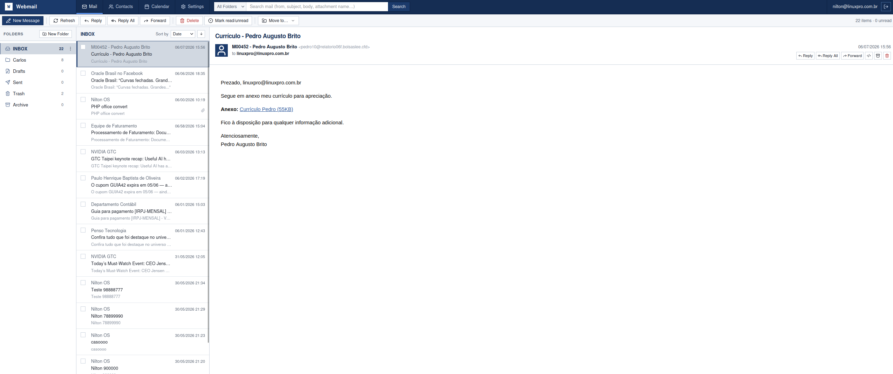
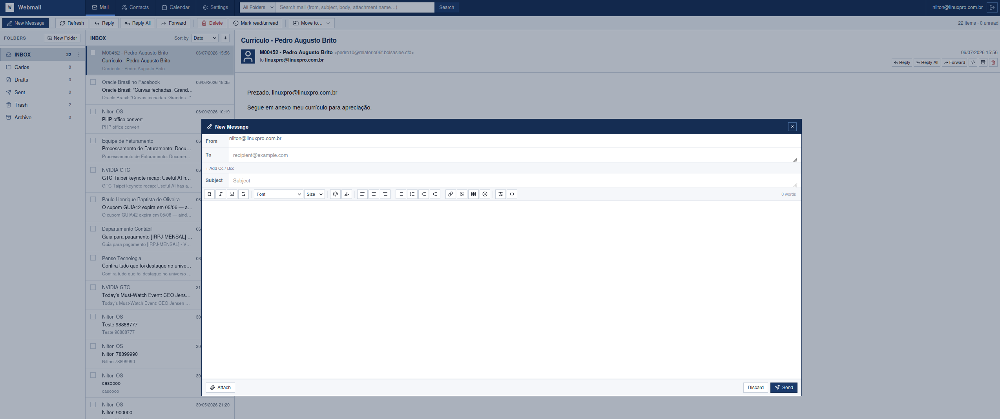
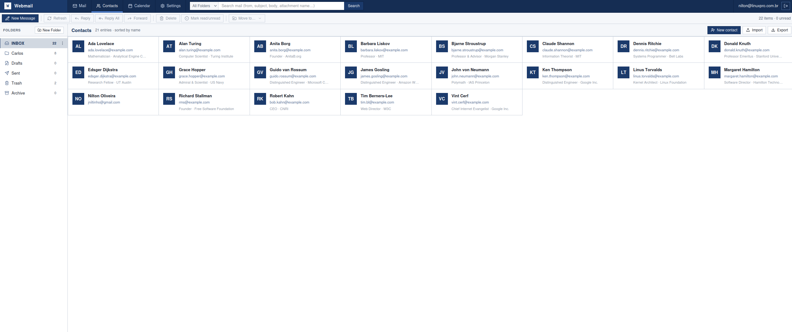
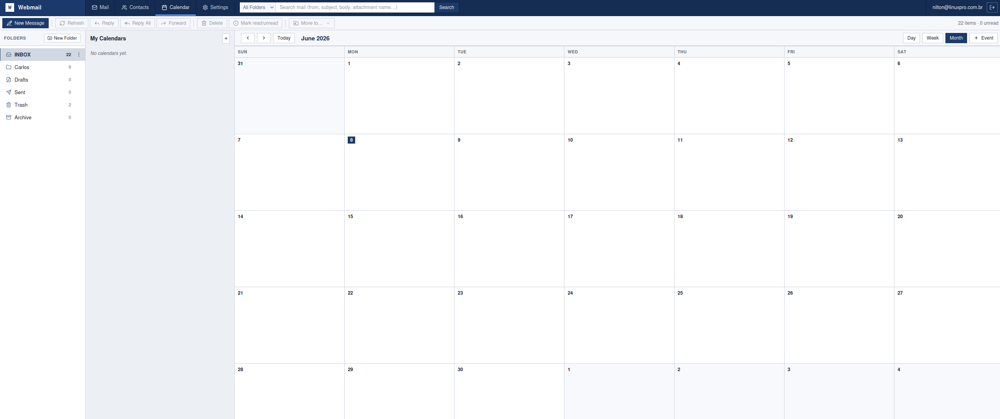

# Go CubeMail

[](https://go.dev/)
[](./LICENSE)
[](https://github.com/jniltinho/go-cubemail/releases)
[](https://github.com/jniltinho/go-cubemail/stargazers)

**Modern self-hosted webmail with calendar and contacts — works with your existing mail server.**

A single Go binary with the entire Vue 3 frontend embedded. Connects directly to your IMAP/SMTP server and exposes full CalDAV, CardDAV and Exchange ActiveSync (EAS) servers so calendars and contacts sync natively with Apple Calendar, Outlook, Thunderbird, iOS, Android and more.

No email migration. No data duplication. Your messages stay on your IMAP server.

Built with a modern Vue 3 + Go stack, inspired by the classic Roundcube "Larry" theme.

## Quick Start

### Pre-built release (recommended)

1. Download the latest Linux binary from the [Releases page](https://github.com/jniltinho/go-cubemail/releases)
2. Extract and initialize:

   ```bash
   tar -xzf go-cubemail_*.tar.gz
   ./go-cubemail init
   ./go-cubemail migrate
   ./go-cubemail serve
   ```

3. Open http://localhost:8080

Pre-built binaries are published on every release. For production setup with MariaDB + systemd, see the [Production Setup Guide](DOCUMENTS/setup/README.md).

### Build from source

Requires Go 1.26+ and Node.js (build time only).

```bash
git clone https://github.com/jniltinho/go-cubemail.git
cd go-cubemail

make all          # builds Vue 3 frontend + embeds into Go binary
./bin/go-cubemail init
./bin/go-cubemail migrate
./bin/go-cubemail serve
```

Access at http://localhost:8080.

Swagger UI (when enabled): `http://localhost:8080/swagger/`.

## Screenshots

| Webmail — 3-column Larry-style interface | Composer with rich text |
|------------------------------------------|-------------------------|
|  |  |

| Contacts management | Calendar view |
|---------------------|---------------|
|  |  |

More screenshots in [DOCUMENTS/screenshots](DOCUMENTS/screenshots).

## Key Features

- **Works with your existing mail server** — No migration. Uses standard IMAP + SMTP. Supports any IMAP-compatible server (Dovecot, Cyrus, Exchange IMAP, etc.).
- **Single binary deployment** — Vue 3 frontend is compiled and embedded. One executable, no separate web server or Node.js at runtime.
- **Real groupware, not just webmail**:
  - Full webmail (3-column UI, rich-text composer, drag & drop, search, keyboard shortcuts)
  - Calendar with recurring events (month/week/day views in UI + full CalDAV backend)
  - Contacts with import/export (CSV + vCard via CardDAV)
- **Native sync for all your devices**:
  - **CalDAV** — Apple Calendar, Thunderbird (TbSync), Evolution, GNOME Calendar
  - **CardDAV** — Apple Contacts, Thunderbird, Evolution
  - **ActiveSync (EAS)** — iOS Mail/Calendar, Android (Outlook/Gmail), Outlook desktop (mail + calendar + contacts)
  - Every calendar and address book syncs as its own folder, over both DAV and ActiveSync — create one in Thunderbird and it appears on the phone
  - Changes made in one client reach the others through a delta sync, deletions included
- **Web Push notifications** — Real-time new mail alerts in the browser even when the tab is in the background (requires HTTPS + VAPID keys).
- **Privacy by design** — Your emails never leave your IMAP server. The database only stores contacts, calendar events, identities, settings and sessions.
- **Multiple identities & signatures** — Send from different addresses with per-identity signatures.
- **Easy to operate** — `./go-cubemail init` generates a ready-to-use config. Database migrations are a single command. Production examples with systemd + MariaDB/PostgreSQL included.
- **Production API** — Versioned REST API with Swagger documentation. Useful for automation and integrations.
- **CLI tools** — `init`, `migrate`, `serve`, `version`.

## Documentation

- [Production Setup Guide](DOCUMENTS/setup/README.md) — Ubuntu + MariaDB + systemd deployment (recommended for production)
- [DAV & Sync Setup](DOCUMENTS/docs/DAV_AND_SYNC_SETUP.md) — CalDAV, CardDAV and ActiveSync configuration + client setup (Thunderbird, iOS, Outlook, Android)
- [CalDAV & CardDAV Implementation](DOCUMENTS/docs/DAV_IMPLEMENTATION.md) — DAV server architecture, design rationale and roadmap
- [Development Guide](DOCUMENTS/docs/DEVELOPMENT.md) — Local development with hot reload
- [Contributing Guide](DOCUMENTS/docs/CONTRIBUTING.md)
- Full API reference via Swagger UI (enable `swagger_enable = true` in config)

## Tech Stack

**Backend**: Go 1.26, Echo v5, GORM, Cobra, Viper, Swaggo (OpenAPI)

**Frontend (embedded)**: Vue 3 + TypeScript + Vite, Pinia, Vue Router, Tailwind CSS v4, TipTap (rich text), Lucide icons

**Email & Sync**:
- IMAP: `emersion/go-imap/v2`
- SMTP: `wneessen/go-mail`
- CalDAV / CardDAV: custom implementation
- ActiveSync (EAS): `remdev/go-activesync` + custom command handlers
- iCalendar (RRULE, VEVENT): custom parser + recurrence engine

**Packaging**: Single binary with embedded SPA, UPX compression support, systemd unit example

## Configuration

The easiest way to start:

```bash
./go-cubemail init
```

This creates a `config_*.toml` file. Rename to `config.toml`, fill in your IMAP/SMTP and database details.

All settings can be overridden with `GORC_` environment variables.

See the [Production Setup Guide](DOCUMENTS/setup/README.md) for MariaDB/PostgreSQL + systemd examples.

## License

This project is licensed under the MIT License — see the [LICENSE](LICENSE) file for details.

## Contributing

Contributions are welcome. Please read:

- [Contributing Guide](DOCUMENTS/docs/CONTRIBUTING.md)
- [Development Guide](DOCUMENTS/docs/DEVELOPMENT.md)

All code, comments and documentation must be in English (see [English Only Policy](DOCUMENTS/specs/english_only.md)).

Found a bug or have an idea? [Open an issue](https://github.com/jniltinho/go-cubemail/issues).
